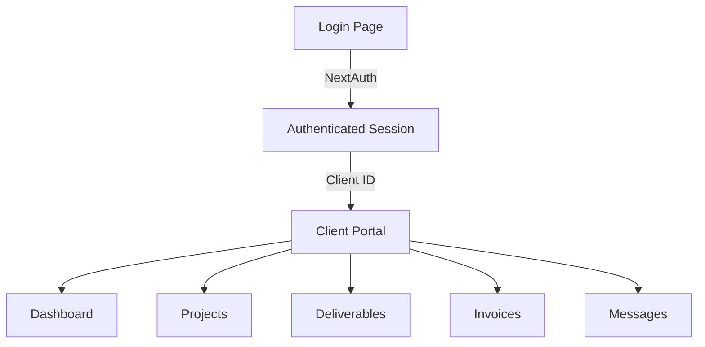

# Client Portal

## Goal

Create a secure, authenticated area where active clients can:
- View project status and milestones
- Access deliverables and assets
- See invoice history and payment status
- Review meeting notes and communication history

## Architecture



## Authentication Options

### Option 1: NextAuth.js
- Email magic links (no passwords)
- Simple setup, free
- Good for small client base

### Option 2: Clerk
- Polished UI out of the box
- More features (MFA, org management)
- Monthly cost

**Recommendation**: Start with NextAuth magic links for simplicity.

## Database Schema

```sql
-- Clients (extends contacts)
CREATE TABLE clients (
  id SERIAL PRIMARY KEY,
  contact_id INTEGER REFERENCES contacts(id),
  company_name TEXT NOT NULL,
  status TEXT DEFAULT 'active',
  portal_enabled BOOLEAN DEFAULT false,
  created_at TIMESTAMP DEFAULT NOW()
);

-- Projects
CREATE TABLE projects (
  id SERIAL PRIMARY KEY,
  client_id INTEGER REFERENCES clients(id),
  name TEXT NOT NULL,
  status TEXT DEFAULT 'active',
  start_date DATE,
  harvest_project_id TEXT,
  created_at TIMESTAMP DEFAULT NOW()
);

-- Deliverables
CREATE TABLE deliverables (
  id SERIAL PRIMARY KEY,
  project_id INTEGER REFERENCES projects(id),
  name TEXT NOT NULL,
  description TEXT,
  status TEXT DEFAULT 'pending',
  file_url TEXT,
  delivered_at TIMESTAMP
);
```

## Portal Pages

| Route | Content |
|-------|---------|
| `/portal` | Dashboard with project summary |
| `/portal/projects` | All projects list |
| `/portal/projects/[id]` | Project detail with deliverables |
| `/portal/invoices` | Invoice history from Harvest |
| `/portal/messages` | Communication thread |

## Files to Create

| File | Purpose |
|------|---------|
| `website/src/app/portal/layout.tsx` | Authenticated portal layout |
| `website/src/app/portal/page.tsx` | Portal dashboard |
| `website/src/app/portal/projects/page.tsx` | Projects list |
| `website/src/app/api/auth/[...nextauth]/route.ts` | NextAuth config |
| `website/src/lib/auth.ts` | Auth utilities |

## Integration Points

- **Harvest API** — Pull invoice data for client view
- **Email** — Send magic links via Resend
- **Data App** — Admin can manage client access
