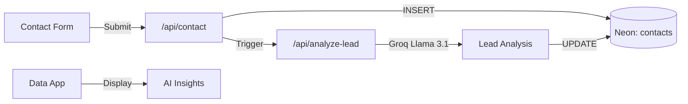

# Lead Qualification & Enrichment

## Goal

Automatically analyze incoming contact form submissions to:
- Score lead quality (0-100) based on fit and intent signals
- Extract specific pain points mentioned in their message
- Suggest follow-up priority (high/medium/low)
- Recommend which methodology phase to discuss first

## Architecture

## Database Changes

Add columns to `contacts` table:
- `lead_score` (integer, 0-100)
- `pain_points` (text array)
- `suggested_priority` (text: high/medium/low)
- `recommended_phase` (text: foundation/activation/acceleration/retention)
- `analysis_timestamp` (timestamp)

## AI Prompt Strategy

The prompt should analyze:
1. **Company context** — Size, industry, digital maturity signals
2. **Pain signals** — Specific problems mentioned
3. **Intent signals** — Urgency, budget mentions, timeline
4. **Fit assessment** — Match with Magnet's ideal client profile

## Files to Create

| File | Purpose |
|------|---------|
| `website/src/app/api/analyze-lead/route.ts` | AI analysis endpoint |
| `data/src/components/LeadInsightsPanel.tsx` | Display AI insights in data app |

## Files to Modify

| File | Change |
|------|--------|
| `website/src/app/api/contact/route.ts` | Trigger AI analysis after save |
| `website/src/lib/db/schema.sql` | Add lead analysis columns |
