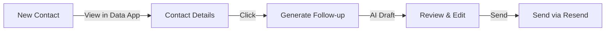

# Personalized Email Follow-ups

## Goal

Use AI to draft personalized follow-up emails for contact form submissions, saving time while maintaining quality and relevance.

## User Flow



## AI Generation Context

The AI receives:
1. **Contact details** — Name, company, message
2. **Lead analysis** — Pain points, priority (from enrichment)
3. **Relevant content** — Case studies, methodology that matches their needs
4. **Email templates** — Base structures to follow

## Email Types to Generate

### 1. Initial Response (same day)
- Thank them for reaching out
- Acknowledge their specific situation/pain points
- Suggest next step (call, resources, etc.)

### 2. Resource Share (day 2-3)
- Share relevant case study or methodology page
- Brief explanation of why it's relevant to them

### 3. Check-in (week 1)
- Gentle follow-up if no response
- New angle or additional value

## Technical Implementation

### API Route
```typescript
// POST /api/generate-followup
{
  contactId: string,
  emailType: 'initial' | 'resource' | 'checkin',
  additionalContext?: string
}
```

### Response
```typescript
{
  subject: string,
  body: string,
  suggestedResources: Array<{ title: string, url: string }>
}
```

## Files to Create

| File | Purpose |
|------|---------|
| `website/src/app/api/generate-followup/route.ts` | AI email generation endpoint |
| `data/src/components/GenerateFollowupModal.tsx` | UI for generating and reviewing |
| `website/src/lib/email/templates/followup-templates.ts` | Base templates for each type |

## Prompt Design

The prompt should:
- Match Magnet's brand voice (confident, direct, helpful)
- Reference specific details from their inquiry
- Avoid generic agency language
- Include clear call-to-action
- Keep emails concise (under 200 words)
