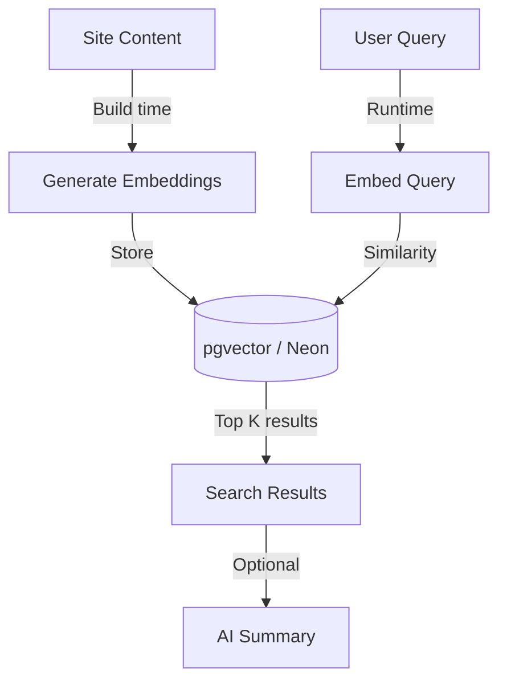

# Semantic Content Search

## Goal

Enable natural language search across all site content — blog posts, methodology pages, case studies — so visitors can ask questions like "How do you approach B2B lead generation?" and get relevant results.

## Architecture

## Content to Index

1. **Blog Posts** — Full text from Sanity
2. **Methodology Pages** — Foundation, Activation, Acceleration, Retention content
3. **Case Studies** — Client work descriptions and outcomes
4. **Service Pages** — What we do, how we work

## Technical Approach

### Embedding Generation
- Use OpenAI `text-embedding-3-small` or similar
- Chunk content into ~500 token segments with overlap
- Store embeddings with metadata (source, title, URL, section)

### Vector Storage Options
1. **Neon with pgvector** — Keep everything in one database
2. **Pinecone** — Dedicated vector DB if scale needed
3. **Vercel AI SDK RAG helpers** — Built-in retrieval support

### Search Flow
1. User enters natural language query
2. Generate embedding for query
3. Find top 5-10 similar content chunks
4. Return results with snippets and links
5. Optionally: Generate AI summary of results

## Files to Create

| File | Purpose |
|------|---------|
| `website/src/app/search/page.tsx` | Search page UI |
| `website/src/app/api/search/route.ts` | Search API endpoint |
| `website/src/lib/embeddings/generate.ts` | Embedding generation utilities |
| `website/src/lib/embeddings/search.ts` | Vector similarity search |
| `scripts/build-embeddings.ts` | Build-time embedding generation |

## Search UI Design

- Large search input with placeholder "Ask anything..."
- Real-time results as user types (debounced)
- Results show: title, snippet with highlighted match, source type badge
- Click to navigate to full page
