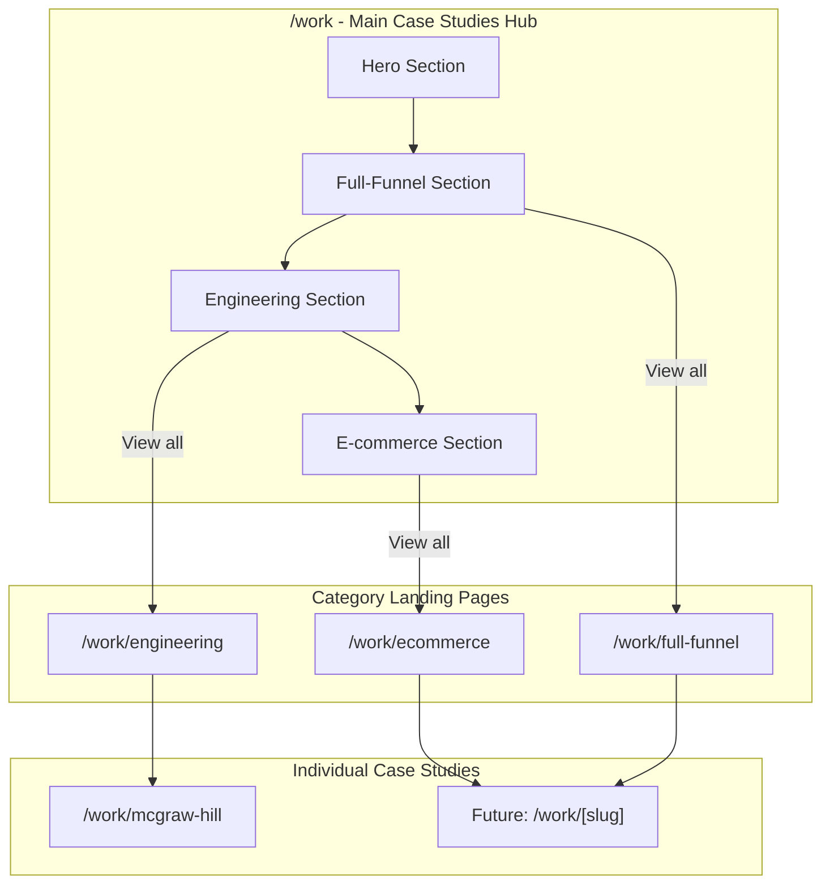

# Ultimate Case Studies Experience

## Architecture Overview



---

## Page Structure

### 1. Main Case Studies Page (`/work/page.tsx`)

A curated, magazine-style page - NOT a traditional card grid.

**Section Order:**

1. **Hero** - "Work that drives results" with aggregate stats ($500M+ revenue, 50+ clients, etc.)

2. **Full-Funnel Revenue Work** (near top, high visibility)

   - Headline: "Revenue architecture across the full funnel"
   - Visual: Horizontal phase diagram (Foundation → Activation → Acceleration → Retention)
   - Interactive cards for each service type (Website Design, Paid Ads, Search Marketing)
   - Featured client logos with results snippets
   - CTA: Link to `/work/full-funnel`

3. **Full-Stack Engineering**

   - Headline: "Enterprise-grade engineering for scale"
   - Featured clients: HGTV, IKEA, Expedia, McGraw Hill, UCLA
   - Display as a `TabbedLogoGallery` with screenshots (reuse existing component from homepage)
   - Each tab shows client logo + screenshot + brief description
   - CTA: Link to `/work/engineering`

4. **E-commerce**

   - Headline: "Commerce experiences that convert"
   - Display using `InteractiveCardsGrid` with e-commerce clients
   - Highlight metrics: AOV increase, conversion rates, revenue
   - CTA: Link to `/work/ecommerce`

5. **Call to Action** - "Let's build something together"

---

### 2. Engineering Category Page (`/work/engineering/page.tsx`)

Rich mini-experience for full-stack engineering work.

**Sections:**

1. **Hero**

   - Headline: "Enterprise engineering for global brands"
   - Subheadline: Deep technical expertise across platforms, frameworks, and scale challenges
   - Stats bar: "6M+ students served (McGraw Hill)", "47 countries", etc.

2. **Capabilities Overview**

   - Grid of engineering capabilities: Platform Engineering, Full-Stack Development, API Design, Data Architecture, DevOps, Performance Optimization
   - Use existing `FeaturesThreeColumn` or new `InteractiveCardsGrid`

3. **Featured Client: McGraw Hill** (hero treatment)

   - Large screenshot gallery
   - Challenge → Solution → Results narrative
   - Link to full case study: `/work/mcgraw-hill`

4. **Other Engineering Clients**

   - Alternating layout using `FeaturesStackedAlternatingWithDemos`
   - HGTV, IKEA, Expedia, UCLA
   - Each with brief description + screenshot + results metric

5. **Technologies We Work With**

   - Logo grid: Next.js, React, TypeScript, Node.js, PostgreSQL, AWS, etc.

6. **Testimonial** - Engineering-specific quote from a client

7. **CTA** - "Discuss your engineering challenges"

---

### 3. Full-Funnel Category Page (`/work/full-funnel/page.tsx`)

Rich mini-experience for revenue-oriented marketing work.

**Sections:**

1. **Hero**

   - Headline: "Full-funnel growth architecture"
   - Subheadline: From foundation to retention — integrated systems that compound

2. **Methodology Visual**

   - Interactive horizontal timeline/accordion showing Foundation → Activation → Acceleration → Retention
   - Each phase expandable with services included
   - Reuse/adapt `ServiceProcess` component pattern

3. **By Service Type** (tabbed or segmented)

   - **Website Design**: Featured clients with results
   - **Paid Media**: Featured clients with ROAS metrics
   - **Search Marketing**: Featured clients with traffic/ranking results
   - Use tabs or anchor links to segment

4. **Results Grid**

   - Aggregate stats: "3.2x average ROI", "$500M+ pipeline generated"
   - `StatsWithGraph` component

5. **Featured Case Studies**

   - Cards for 3-4 full-funnel clients
   - Each showing which phases were applied

6. **Testimonial** - Marketing leader quote

7. **CTA** - "Build your growth engine"

---

### 4. E-commerce Category Page (`/work/ecommerce/page.tsx`)

Rich mini-experience for e-commerce work.

**Sections:**

1. **Hero**

   - Headline: "Commerce experiences that convert"
   - Subheadline: Shopify, headless, and custom e-commerce solutions

2. **Platform Expertise**

   - Logo grid: Shopify, Shopify Plus, BigCommerce, WooCommerce, Magento, Headless
   - Brief capability description for each

3. **Results Stats**

   - AOV increases, conversion rate improvements, revenue growth
   - `StatsWithGraph` or `StatsFourColumns`

4. **Featured E-commerce Clients**

   - Alternating layout with screenshots
   - Focus on metrics: "+47% conversion", "$2.3M revenue increase"

5. **Testimonial** - E-commerce client quote

6. **CTA** - "Scale your commerce"

---

### 5. McGraw Hill Case Study Page (`/work/mcgraw-hill/page.tsx`)

The prototype individual case study page.

**Sections:**

1. **Hero**

   - Client logo (large)
   - Headline: "Empowering 6 million students with scalable educational technology"
   - Industry tag: Education / EdTech
   - Services tags: Platform Engineering, Full-Stack Development

2. **Results Bar**

   - 3-4 key metrics in a horizontal strip
   - "6M+ students", "99.9% uptime", "47 states", "4 years partnership"

3. **The Challenge**

   - Rich text block explaining the problem
   - Supporting visual/screenshot

4. **The Solution**

   - What we built, technologies used
   - Architecture diagram or system visualization
   - Multiple screenshots

5. **The Results**

   - Detailed metrics with context
   - Before/after comparisons where applicable

6. **Testimonial** (full-width)

   - Large quote from McGraw Hill stakeholder
   - Photo, name, title

7. **Team**

   - "Led by [Team Lead]" with avatar
   - Optional: Other team members involved

8. **Related Work**

   - 2-3 cards for other engineering case studies
   - "More engineering work" link

9. **CTA** - "Start a conversation"

---

## File Structure

```
website/src/app/work/
├── page.tsx                    # Main case studies hub
├── engineering/
│   └── page.tsx                # Engineering category page
├── full-funnel/
│   └── page.tsx                # Full-funnel category page
├── ecommerce/
│   └── page.tsx                # E-commerce category page
└── mcgraw-hill/
    └── page.tsx                # McGraw Hill case study (prototype)
```

---

## New Components Needed

### 1. `CaseStudyHero` (new section component)

For individual case study pages - large logo, headline, tags, results bar.

### 2. `MethodologyTimeline` (new element component)

Horizontal interactive Foundation → Retention visualization for full-funnel page.

### 3. `CaseStudyCard` (new element component)

Compact card for linking to individual case studies from category pages.

- Logo, title, brief description, 1-2 key metrics, arrow link

### 4. `ResultsBar` (new element component)

Horizontal strip of 3-4 key metrics, used on case study pages and category pages.

---

## Existing Components to Reuse

- `TabbedLogoGallery` - Engineering section on main page (already used on homepage)
- `InteractiveCardsGrid` - E-commerce section, capabilities grids
- `FeaturesStackedAlternatingWithDemos` - Client showcases
- `FeaturesBentoGrid` - Service type breakdowns
- `StatsWithGraph` - Results sections
- `TestimonialTwoColumnWithLargePhoto` - Testimonials
- `ServiceProcess` - Adapt for methodology visualization
- `CallToActionWithEmail` - Page CTAs
- `Screenshot` - All client screenshots
- `Eyebrow`, `Heading`, `Subheading`, `Text` - Typography

---

## Data Structure (Hardcoded for Now)

```typescript
// website/src/lib/case-studies/data.ts

export interface CaseStudy {
  slug: string
  client: string
  logo: string
  industry: string
  category: 'engineering' | 'full-funnel' | 'ecommerce'
  services: string[]
  phases?: ('foundation' | 'activation' | 'acceleration' | 'retention')[]
  headline: string
  description: string
  challenge?: string
  solution?: string
  results: { metric: string; label: string }[]
  testimonial?: {
    quote: string
    author: string
    role: string
    image?: string
  }
  screenshots: string[]
  featured?: boolean
}

export const caseStudies: CaseStudy[] = [
  {
    slug: 'mcgraw-hill',
    client: 'McGraw Hill',
    logo: '/img/logos/mhe.png',
    industry: 'Education',
    category: 'engineering',
    services: ['Platform Engineering', 'Full-Stack Development'],
    headline: 'Empowering 6 million students with scalable educational technology',
    description: 'Comprehensive platform engineering for their Engrade platforms...',
    results: [
      { metric: '6M+', label: 'Students served' },
      { metric: '99.9%', label: 'Uptime achieved' },
      { metric: '47', label: 'States deployed' },
    ],
    screenshots: ['/img/screenshots/...'],
    featured: true,
  },
  // ... HGTV, IKEA, Expedia, UCLA, etc.
]
```

---

## Implementation Order

1. **Data file** - Create `website/src/lib/case-studies/data.ts` with all case study data
2. **Main page** - Build `/work/page.tsx` with all sections
3. **McGraw Hill page** - Build `/work/mcgraw-hill/page.tsx` as prototype
4. **New components** - Build `CaseStudyHero`, `ResultsBar`, `CaseStudyCard` as needed
5. **Engineering category** - Build `/work/engineering/page.tsx`
6. **Full-funnel category** - Build `/work/full-funnel/page.tsx`
7. **E-commerce category** - Build `/work/ecommerce/page.tsx`
8. **Navigation** - Add "Work" to main navigation

---

## Future: Sanity Migration

Once the prototype is validated, migrate to Sanity CMS:

- The existing `caseStudy` schema in [studio/schemaTypes/caseStudy.ts](studio/schemaTypes/caseStudy.ts) is already well-structured
- Add `category` field for engineering/full-funnel/ecommerce segmentation
- Replace hardcoded data with Sanity queries
- Individual pages become `/work/[slug]/page.tsx` with dynamic routing