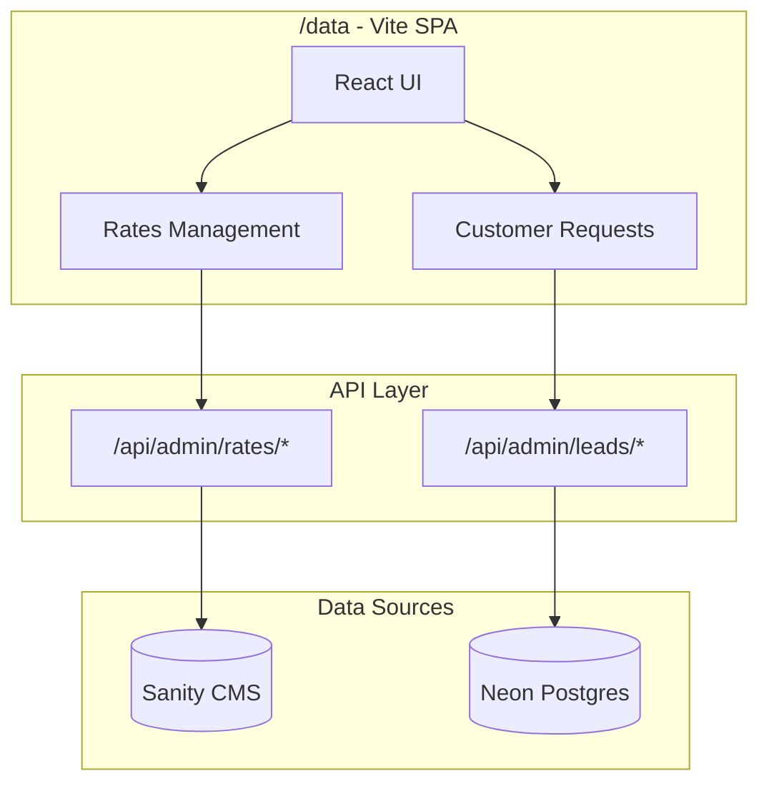
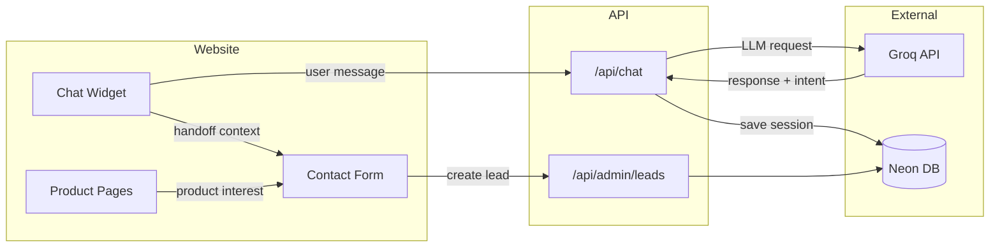

# Data CRUD App Migration Plan

## Overview

Create a new Vite + React SPA at `/data` in the project root that:

- Replicates the existing rates management functionality from [website/app/admin](website/app/admin)
- Adds customer requests/leads management connected to Neon DB
- Deploys to subdomain (e.g., `data.deseret.com`)
- Uses the same `RATES_ADMIN_PASSWORD` authentication

---

## Architecture



---

## Customer Request Schema (Neon DB)

Based on your requirements, the `customer_requests` table will store:

```sql
CREATE TABLE customer_requests (
  id UUID PRIMARY KEY DEFAULT gen_random_uuid(),
  created_at TIMESTAMP DEFAULT NOW(),
  updated_at TIMESTAMP DEFAULT NOW(),
  status VARCHAR(20) DEFAULT 'new',  -- new, contacted, converted, closed
  
  -- Contact Info
  name VARCHAR(255),
  email VARCHAR(255),
  phone VARCHAR(50),
  message TEXT,
  
  -- Structured Service Data (not appended to message)
  service_category VARCHAR(50),      -- savings, checking, business, loans, etc.
  service_product VARCHAR(100),      -- specific product name/slug
  enquiry_type VARCHAR(50),          -- open_account, visit_branch, online_help, general
  
  -- Source Tracking
  source VARCHAR(50),                -- chat_widget, product_page, contact_form
  source_page VARCHAR(255),          -- URL where they started
  chat_context JSONB,                -- AI chat history/context if from widget
  
  -- Admin
  notes TEXT,
  assigned_to VARCHAR(100)
);
```

---

## File Structure for `/data`

```
/data
├── index.html
├── package.json
├── vite.config.ts
├── tsconfig.json
├── .env.example
├── vercel.json                    # SPA routing + env vars
├── src/
│   ├── main.tsx
│   ├── App.tsx
│   ├── index.css                  # Tailwind
│   ├── api/
│   │   ├── client.ts              # Fetch wrapper with auth
│   │   ├── rates.ts               # Rates API calls
│   │   └── leads.ts               # Customer requests API calls
│   ├── components/
│   │   ├── PasswordGate.tsx       # Auth gate (replicated)
│   │   ├── Layout.tsx             # App shell with nav
│   │   ├── rates/                 # Rates components (adapted from admin)
│   │   │   ├── RateEditor.tsx
│   │   │   ├── sections/
│   │   │   ├── panels/
│   │   │   └── ui/
│   │   └── leads/                 # Customer requests components
│   │       ├── LeadsTable.tsx
│   │       ├── LeadDetail.tsx
│   │       └── LeadFilters.tsx
│   ├── hooks/
│   │   └── useAuth.ts
│   └── types/
│       ├── rates.ts               # Copied from admin
│       └── leads.ts               # New lead types
└── tailwind.config.js
```

---

## API Endpoints (add to website/)

New endpoints in [website/app/api/admin/](website/app/api/admin/):

**Customer Requests API** - `leads/route.ts`:

- `GET /api/admin/leads` - List with filters (status, service, date range)
- `GET /api/admin/leads/[id]` - Get single lead
- `POST /api/admin/leads` - Create (for contact form submissions)
- `PATCH /api/admin/leads/[id]` - Update status, notes, assignment
- `DELETE /api/admin/leads/[id]` - Soft delete

---

## Key Adaptations from Current Admin

**Components to replicate** (adapt from `'use client'` to standard React):

- `PasswordGate.tsx` - Auth UI
- `RateEditor.tsx` - Main rates editor
- All section components (Savings, HomeEquity, CreditCards, Business)
- Panel components (ChangeLog, ScheduledChanges)
- UI primitives (EditableTable, RateInput, ProductCard)
- Types and utilities from `types/rates.ts`

**Changes needed**:

- Remove Next.js-specific imports (`next/navigation`, etc.)
- Replace `@/` imports with relative paths or Vite aliases
- API calls point to `website` subdomain (CORS configured)
- Environment variables via `import.meta.env.VITE_*`

---

## Deployment Configuration

**vercel.json** for `/data`:

```json
{
  "rewrites": [{ "source": "/(.*)", "destination": "/index.html" }],
  "headers": [
    {
      "source": "/(.*)",
      "headers": [{ "key": "Cache-Control", "value": "no-store" }]
    }
  ]
}
```

**CORS** - Add to website API routes:

```typescript
// Allow requests from data.deseret.com subdomain
const allowedOrigins = ['https://data.deseret.com', 'http://localhost:5173']
```

---

## Implementation Order

### Phase 1: Data CRUD App

1. **Setup Vite app** - Initialize with React + TypeScript + Tailwind
2. **Add auth** - Password gate using same env var
3. **Migrate rates UI** - Copy and adapt components from admin
4. **Add leads API** - Create Neon table and API routes in website
5. **Build leads UI** - Table view, filters, detail panel
6. **Configure deployment** - Vercel project for subdomain
7. **Test end-to-end** - Both rates and leads CRUD operations

### Phase 2: AI Chat Widget

8. **Chat API** - Groq-powered chat endpoint
9. **Chat Widget UI** - Floating widget for website
10. **Service Matching** - Intent detection and product recommendations
11. **Context Handoff** - Prefill contact forms with chat context
12. **Persistence** - Save sessions to Neon for admin visibility

---

## Phase 2: AI Chat Widget

### Architecture



### Chat Widget Features

**User-facing (in website/)**:

- Floating button in bottom-right corner
- Expandable chat interface with message history
- Quick-action buttons for common intents
- "Talk to someone" CTA that hands off to contact form
- Product recommendations based on conversation

**Service Matching**:

- Groq analyzes conversation to detect:
  - Service category (savings, checking, loans, business, etc.)
  - Specific products mentioned
  - Enquiry type (open account, get help, visit branch)
- Returns structured JSON alongside conversational response

**Context Handoff to Contact Form**:

- When user clicks "Contact Us" from chat:
  - Service category pre-selected
  - Product interest populated
  - Message field prefilled with summary
  - Full chat history saved as `chat_context` in lead record

### Chat API Design

**POST /api/chat** - `website/app/api/chat/route.ts`:

```typescript
// Request
{
  sessionId: string,        // UUID for conversation continuity
  message: string,          // User's message
  pageContext?: {           // Current page info
    url: string,
    productSlug?: string
  }
}

// Response
{
  reply: string,            // AI response to display
  intent?: {                // Structured service matching
    category: string,       // savings, checking, loans, etc.
    product?: string,       // specific product if identified
    enquiryType?: string,   // open_account, help, visit_branch
    confidence: number      // 0-1 confidence score
  },
  suggestedActions?: [      // Quick action buttons
    { label: string, action: string }
  ]
}
```

### Groq System Prompt (example)

```
You are a helpful assistant for Deseret First Credit Union. Your role is to:
1. Answer questions about our products and services
2. Help users find the right financial product for their needs
3. Guide them toward speaking with a representative when appropriate

Available services: Savings Accounts, Checking Accounts, Auto Loans, 
Home Equity, Credit Cards, Business Accounts, Certificates.

After each response, analyze the conversation and return a JSON object with:
- category: the service category they're interested in (or null)
- product: specific product name if mentioned (or null)  
- enquiryType: "open_account", "get_help", "visit_branch", or "general"
- confidence: 0-1 score of how confident you are in the intent

Be friendly, concise, and always offer to connect them with a team member.
```

### File Structure Addition (website/)

```
website/app/
├── api/
│   └── chat/
│       └── route.ts           # Groq chat endpoint
├── components/
│   └── chat/
│       ├── ChatWidget.tsx     # Main floating widget
│       ├── ChatBubble.tsx     # Message bubble component
│       ├── ChatInput.tsx      # Input with send button
│       └── QuickActions.tsx   # Suggested action buttons
```

### Environment Variables

Add to `.env.local`:

```env
# Groq API (get from https://console.groq.com/keys)
GROQ_API_KEY=gsk_xxxxxxxxxxxxxxxxxxxx
```

**How to get your Groq API key**:

1. Go to https://console.groq.com
2. Sign up or log in
3. Navigate to "API Keys" in the sidebar
4. Click "Create API Key"
5. Copy the key (starts with `gsk_`)
6. Add to your `.env.local` as `GROQ_API_KEY=gsk_...`

### Chat Session Storage (Neon)

```sql
CREATE TABLE chat_sessions (
  id UUID PRIMARY KEY DEFAULT gen_random_uuid(),
  created_at TIMESTAMP DEFAULT NOW(),
  updated_at TIMESTAMP DEFAULT NOW(),
  
  -- Session data
  messages JSONB DEFAULT '[]',        -- Array of {role, content, timestamp}
  
  -- Detected intent (updated as conversation progresses)
  detected_category VARCHAR(50),
  detected_product VARCHAR(100),
  detected_enquiry_type VARCHAR(50),
  
  -- Conversion tracking
  converted_to_lead_id UUID REFERENCES customer_requests(id),
  source_page VARCHAR(255)
);
```

### Product Page Integration

When user is on a product page and clicks "Learn More" or "Get Started":

- Opens contact form (not chat)
- Pre-fills `service_category` and `service_product` from page context
- Message field shows: "I'm interested in learning more about [Product Name]"
- This creates a lead with `source: 'product_page'`