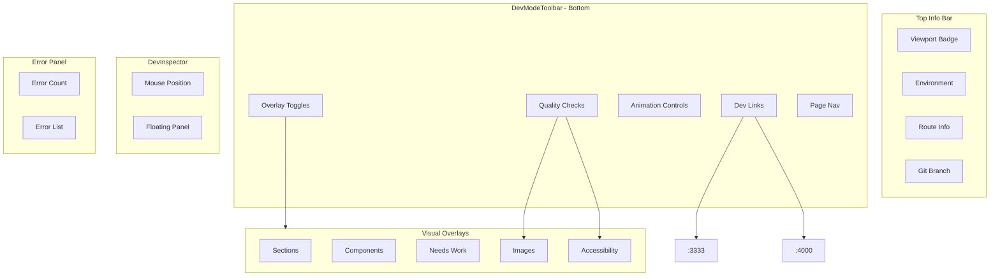

# Dev Mode Enhancements

## New Features

### 1. Hover Inspector Panel

When dev mode is active, hovering any element shows a floating panel with:

- Component name and file path (clickable to open in Cursor)
- Data source (props/sanity/api/static)
- Box model: padding, margin, dimensions
- Tailwind classes in use
- Position in component tree (breadcrumb)

Implementation: A single `DevInspector` component that listens to mousemove, finds the nearest `[data-dev-*]` ancestor, and renders a tooltip panel.

### 2. Persistent Viewport Indicator

Small fixed badge (top-left) showing:

- Current breakpoint: `sm` / `md` / `lg` / `xl` / `2xl`
- Viewport dimensions: `1440 x 900`
- Scroll position (optional)

Always visible when dev mode is active - no interaction needed.

### 3. Quick Source Links

Click any labeled element to copy its file path, or Cmd+click to open in Cursor via `cursor://file/` URL scheme.

### 4. Design Token Overlay

Toggle to highlight elements and show which design tokens are in use:

- Color swatches for text/bg colors (ember, coral, powder, etc.)
- Spacing indicators (show gap/padding values)
- Typography info (font-size, weight, line-height)

### 5. Keyboard Navigation

- `Esc` - close dev mode
- `1-5` - toggle each overlay type
- `I` - toggle inspector mode
- Arrow keys - navigate between sibling sections

### 6. Quick Dev Links

Icon buttons in the toolbar for instant access to:

- **Studio** (localhost:3333) - Sanity CMS
- **Data** (localhost:4000) - CRUD app

Opens in new tab. Shows connection status indicator (green dot if reachable, gray if not).

### 7. Environment Indicator

Clear visual indicator of current environment:
- **DEV** (green) - localhost
- **STAGING** (yellow) - staging URL
- **PROD** (red) - production URL

Shown in viewport badge area, always visible when dev mode active.

### 8. Console Error Badge

Small red badge showing count of JavaScript errors:
- Click to expand recent error list
- Shows stack trace preview
- Link to full console

### 9. Image Checker

Toggle overlay that flags image issues:
- Missing `alt` text (red outline)
- Not using `next/image` (orange outline)
- Oversized images (yellow outline + actual vs displayed size)
- Shows optimization suggestions on hover

### 10. Animation Controls

Toolbar controls for animations:
- **Pause** - freeze all CSS/JS animations
- **Slow** - 0.25x speed for debugging timing
- **Normal** - restore default speed

### 11. Accessibility Quick-Check

Toggle overlay showing a11y issues:
- Heading hierarchy visualization (H1 → H2 → H3 tree)
- Low contrast text (flagged with ratio)
- Missing landmark regions
- Focus order indicators

### 12. Route Info Panel

Shows current Next.js routing context:
- Current pathname: `/pricing`
- Route params: `{ slug: 'websites' }`
- Search params: `?ref=nav`
- Click to copy any value

### 13. Git Branch Indicator

Shows current git branch in toolbar:
- Branch name with icon
- Indicator if uncommitted changes exist
- Click to copy branch name

### 14. Quick Page Navigation

Dropdown in toolbar for jumping to key pages:
- Home, Pricing, Contact, Team, etc.
- Recently visited pages
- All routes from app directory

## Architecture



## File Changes

**Updated Files:**
- `dev-mode-provider.tsx` - Expand state for all new toggles, keyboard shortcuts
- `dev-mode-toolbar.tsx` - Complete rebuild with new layout and controls
- `dev-outline.tsx` - Add `data-dev-file` attribute for source paths
- `globals.css` - Styles for all overlays, panels, and animations
- `layout.tsx` - Add DevTopBar component

**New Files:**
- `dev-top-bar.tsx` - Top info bar (viewport, env, route, git, errors)
- `dev-inspector.tsx` - Hover-based element inspector panel
- `dev-image-checker.tsx` - Image optimization overlay
- `dev-a11y-checker.tsx` - Accessibility checker overlay
- `dev-error-panel.tsx` - Expandable JS error list
- `dev-page-nav.tsx` - Quick page navigation dropdown
- `dev-animation-controls.tsx` - Pause/slow/play animation controls

## Inspector Panel Content

When hovering a `DevOutline` wrapped element:

```
┌─────────────────────────────────────┐
│ FeaturesBentoGrid                   │
│ sections/features-bento-grid.tsx    │  ← click to copy, cmd+click opens
├─────────────────────────────────────┤
│ Source: props                       │
│ Size: 1200 x 560                    │
│ Padding: 80px 40px                  │
├─────────────────────────────────────┤
│ page → main → section#services      │  ← breadcrumb
└─────────────────────────────────────┘
```

## Viewport Badge

Fixed top-left corner, minimal:

```
┌──────────────┐
│ lg · 1440×900│
└──────────────┘
```

Changes color at each breakpoint for quick visual reference.

## UI Layout

**Top Bar** (fixed top-left, contextual info):
```
┌─────────────────────────────────────────────────────────────┐
│ DEV │ lg · 1440×900 │ /pricing │ main ● │ 2 errors │
└─────────────────────────────────────────────────────────────┘
  ↑env   ↑viewport      ↑route    ↑git      ↑click to expand
```

**Bottom Toolbar** (fixed bottom-right, controls):
```
┌──────────────────────────────────────────────────────────────────────────────────┐
│ Sections │ Components │ Needs Work │ Labels │ Images │ A11y │ ▶ │ ●Studio ●Data │ ⋮ │ ✕ │
└──────────────────────────────────────────────────────────────────────────────────┘
                                               ↑anim    ↑status  ↑pages
```

- Overlay toggles: Sections, Components, Needs Work, Labels
- Quality toggles: Images, A11y (accessibility)
- Animation: ▶ (play) / ⏸ (pause) / 🐢 (slow)
- Dev links: Studio/Data with status dots
- Page nav: ⋮ dropdown for quick navigation

## Implementation Notes

**Git Branch Detection:**
- Use a build-time script or API route that runs `git branch --show-current`
- Cache result, refresh on window focus

**Error Tracking:**
- Hook into `window.onerror` and `window.onunhandledrejection`
- Store last N errors in state
- Show count badge, expandable panel

**Image Checker:**
- Query all `` elements on page
- Check for `alt` attribute, `data-nimg` (next/image marker)
- Compare `naturalWidth/Height` vs `clientWidth/Height` for oversizing

**A11y Checker:**
- Query heading elements, build hierarchy tree
- Use `window.getComputedStyle` for contrast calculations
- Check for landmark roles (`main`, `nav`, `footer`, etc.)

**Animation Controls:**
- Inject CSS: `* { animation-play-state: paused !important; transition: none !important; }`
- For slow mode: `* { animation-duration: 4s !important; transition-duration: 2s !important; }`

## Keyboard Shortcuts

| Key | Action |
|-----|--------|
| `⌘⇧G` | Toggle dev mode |
| `Esc` | Close dev mode |
| `1` | Toggle sections |
| `2` | Toggle components |
| `3` | Toggle needs work |
| `4` | Toggle labels |
| `5` | Toggle images |
| `6` | Toggle a11y |
| `I` | Toggle inspector |
| `P` | Pause animations |
| `E` | Toggle error panel |

## Usage

1. **Activate**: Footer "Grid" link or `⌘⇧G`
2. **Top bar** shows: environment, viewport, current route, git branch, error count
3. **Hover** any element to see inspector panel with component info
4. **Click** component name to copy path, `⌘+click` to open in Cursor
5. **Toggle overlays** via toolbar or number keys
6. **Debug animations** with pause/slow controls
7. **Check quality** with image and a11y overlays
8. **Navigate** via page dropdown or Studio/Data links
9. **Esc** to exit