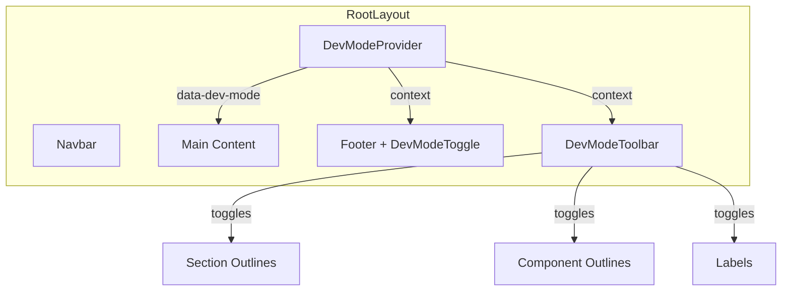

# Dev Mode Grid Outline Wrapper

## Architecture

The system uses a React context to manage dev mode state, CSS data attributes for performant outline rendering, and a floating toolbar for quick toggling.



## Implementation

### 1. DevModeProvider (`website/src/components/dev/dev-mode-provider.tsx`)

Client component that provides context for dev mode state:

- `isActive` - whether dev mode is enabled
- `showSections` - toggle section-level outlines
- `showComponents` - toggle component-level outlines
- `showLabels` - toggle label visibility

Sets `data-dev-mode`, `data-dev-sections`, `data-dev-components` attributes on `<html>` for CSS targeting.

### 2. DevModeToolbar (`website/src/components/dev/dev-mode-toolbar.tsx`)

Floating toolbar that appears when dev mode is active:

- Fixed position bottom-right
- Compact toggle buttons for sections/components/labels
- Close button to deactivate dev mode
- Discrete styling (monospace, small text, semi-transparent)

### 3. DevOutline (`website/src/components/dev/dev-outline.tsx`)

A wrapper component that can be applied to any element:

```tsx
<DevOutline name="FeaturesBentoGrid" type="section" source="props">
  <FeaturesBentoGrid ... />
</DevOutline>
```

Properties:

- `name` - Component/section name for label
- `type` - "section" | "component" for different outline colors
- `source` - Optional data source indicator (props, sanity, api, etc.)

### 4. CSS Styles (add to `globals.css`)

```css
/* Dev mode outlines - only apply when data attributes present */
[data-dev-mode="true"][data-dev-sections="true"] section {
  outline: 2px solid rgba(59, 130, 246, 0.6);
  outline-offset: -2px;
}

[data-dev-mode="true"][data-dev-components="true"] [data-dev-outline="component"] {
  outline: 2px dashed rgba(59, 130, 246, 0.4);
  outline-offset: -2px;
}
```

### 5. Layout Integration ([`website/src/app/layout.tsx`](website/src/app/layout.tsx))

- Wrap body content in `DevModeProvider`
- Add dev toggle link to existing dev-only footer section (alongside Studio/Data)
- Toolbar renders automatically when active

### 6. Footer Toggle Link

Add to existing dev-mode section in footer (lines 132-150):

```tsx
{process.env.NODE_ENV === 'development' && (
  <>
    <DevModeToggle /> {/* New */}
    <a href="http://localhost:3333" ...>Studio</a>
    <a href="http://localhost:4000" ...>Data</a>
  </>
)}
```

## Key Files

| File | Purpose |

|------|---------|

| `website/src/components/dev/dev-mode-provider.tsx` | Context + state management |

| `website/src/components/dev/dev-mode-toolbar.tsx` | Floating control panel |

| `website/src/components/dev/dev-outline.tsx` | Wrapper for labeled outlines |

| `website/src/components/dev/index.ts` | Barrel export |

| `website/src/app/globals.css` | CSS outline rules |

| `website/src/app/layout.tsx` | Provider + footer toggle |

## Usage After Implementation

1. Click "Grid" link in footer (dev mode only)
2. Floating toolbar appears with toggle buttons
3. Toggle sections/components/labels independently
4. Click X or "Grid" again to deactivate

For custom component labeling, wrap with `DevOutline`:

```tsx
<DevOutline name="TeamCarousel" type="component" source="sanity">
  <TeamCarouselSection members={members} />
</DevOutline>
```