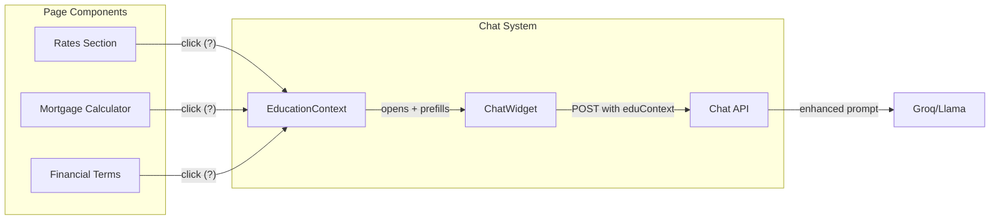

# Financial Education Integration for Chat Widget

## Architecture Overview



## Feature Breakdown

### 1. Education Context Provider

Create a React context that allows any component to trigger the chat with educational context.

**New file:** [`website/lib/education-context.tsx`](website/lib/education-context.tsx)

```tsx
// Core interface
interface EducationContext {
  openChatWithQuestion: (question: string, context?: EducationMeta) => void
}

interface EducationMeta {
  term?: string           // e.g., "APR", "PMI", "LTV"
  value?: string          // e.g., "6.875%"
  category?: string       // e.g., "mortgage", "savings"
  calculatorState?: any   // Current calculator values for guidance
}
```

### 2. Explainable Term Component

Reusable component that wraps financial terms with an info icon.

**New file:** [`website/app/components/elements/ExplainableTerm.tsx`](website/app/components/elements/ExplainableTerm.tsx)

```tsx
// Usage in rates components:
<ExplainableTerm term="APR" value="6.875%" category="mortgage">
  6.875% APR
</ExplainableTerm>

// Renders:
// 6.875% APR (?) <- clicking (?) opens chat with "What does APR mean?"
```

### 3. ChatWidget Modifications

**File:** [`website/app/components/ChatWidget.tsx`](website/app/components/ChatWidget.tsx)

Changes needed:

- Accept `initialQuestion` and `educationContext` from provider
- Add `useEducationContext()` hook consumption
- Auto-open and send question when triggered externally
- New "lesson" message type for multi-step educational flows

### 4. Chat API Enhancement

**File:** [`website/app/api/chat/route.ts`](website/app/api/chat/route.ts)

Enhance system prompt with education mode:

- Detect educational questions (what is, explain, how does X work)
- Format responses with structured explanations
- Include "Related topics" suggestions for continued learning
- Calculator-aware guidance when `calculatorState` is provided

### 5. Component Integration Points

**Rates components to update:**

- [`website/app/components/sections/Rates.tsx`](website/app/components/sections/Rates.tsx) - Add `ExplainableTerm` to rate values
- [`website/app/components/sections/RatesTableSection.tsx`](website/app/components/sections/RatesTableSection.tsx) - Add `ExplainableTerm` to table cells
- [`website/app/components/sections/MortgageCalculator.tsx`](website/app/components/sections/MortgageCalculator.tsx) - Add guidance icon that sends calculator state to chat

### 6. Interactive Lessons (Optional Enhancement)

Structured lesson flows triggered by user interest:

- "I want to learn about mortgages" -> multi-turn guided conversation
- Track lesson progress in session
- Suggest next topics based on conversation

## Implementation Order

1. **Education Context** - Foundation for all features
2. **ExplainableTerm** - Reusable UI component  
3. **ChatWidget updates** - Accept external triggers
4. **API prompt enhancement** - Better educational responses
5. **Rates integration** - Add icons to existing components
6. **Calculator guidance** - Deep integration with mortgage calculator
7. **Lessons** (stretch) - Structured educational flows

## Key Files Summary

| File | Change Type | Purpose |

|------|-------------|---------|

| `website/lib/education-context.tsx` | New | Context provider for education triggers |

| `website/app/components/elements/ExplainableTerm.tsx` | New | Info icon wrapper component |

| `website/app/components/ChatWidget.tsx` | Modify | Accept external questions |

| `website/app/api/chat/route.ts` | Modify | Enhanced education prompts |

| `website/app/layout.tsx` | Modify | Wrap with EducationProvider |

| `website/app/components/sections/Rates.tsx` | Modify | Add explainable terms |

| `website/app/components/sections/RatesTableSection.tsx` | Modify | Add explainable terms |

| `website/app/components/sections/MortgageCalculator.tsx` | Modify | Add calculator guidance |