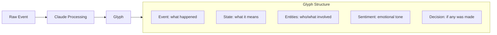

# Glyph V1 - Context Collection Prototype

## Goal

Validate two hypotheses:
1. **Collection**: What context can we actually capture from Slack + Gmail?
2. **Distillation**: Can Claude transform raw events into meaningful "Glyphs"?

## What is a Glyph?

A Glyph is an atomic unit of knowledge that captures both:
- **Event truth**: What happened (the action, the message, the interaction)
- **State truth**: What it means (sentiment, entities involved, topic, decision made)



## Simplified Architecture

```mermaid
flowchart TB
    subgraph sources [Data Sources]
        Slack[Slack Bot Token]
        Gmail[Gmail API]
    end
    
    subgraph app [Next.js App]
        Collect[/api/collect/*]
        Process[/api/process]
        View[Dashboard UI]
    end
    
    subgraph ai [AI]
        Claude[Claude API]
    end
    
    subgraph db [Storage]
        Neon[(Neon Postgres)]
    end
    
    Slack -->|Pull messages| Collect
    Gmail -->|Pull emails| Collect
    Collect --> Neon
    Process --> Claude
    Claude --> Neon
    View --> Neon
```

## Tech Stack (Minimal)

| Layer | Choice | Why |
|-------|--------|-----|
| Framework | Next.js 14 App Router | Fast to build |
| Database | Vercel Postgres | Free, managed |
| ORM | Drizzle | Type-safe, lightweight |
| AI | Claude API | Your preference |
| UI | Tailwind + shadcn | Quick styling |

**Removed**: Auth, background jobs (Inngest), KV cache, embeddings, graph viz

## Data Model (Simplified)

```sql
-- Raw events from any source
CREATE TABLE raw_events (
  id UUID PRIMARY KEY,
  source TEXT NOT NULL,        -- 'slack' | 'gmail'
  source_id TEXT NOT NULL,     -- original ID from source
  event_type TEXT NOT NULL,    -- 'message' | 'email' | 'reaction'
  content TEXT,
  metadata JSONB,              -- source-specific data
  occurred_at TIMESTAMP,
  created_at TIMESTAMP DEFAULT NOW()
);

-- Processed Glyphs
CREATE TABLE glyphs (
  id UUID PRIMARY KEY,
  raw_event_id UUID REFERENCES raw_events(id),
  
  -- Event truth
  summary TEXT NOT NULL,       -- What happened in one sentence
  event_type TEXT,             -- 'discussion' | 'decision' | 'question' | 'update'
  
  -- State truth  
  sentiment TEXT,              -- 'positive' | 'negative' | 'neutral' | 'urgent'
  confidence REAL,             -- 0-1 AI confidence
  
  -- Entities
  entities JSONB,              -- [{type: 'person', name: 'John'}, {type: 'project', name: 'Glyph'}]
  topics TEXT[],               -- ['engineering', 'deadline', 'budget']
  
  -- Decision tracking
  decision TEXT,               -- If a decision was made, what was it?
  action_items JSONB,          -- [{assignee: 'John', task: 'Review PR'}]
  
  created_at TIMESTAMP DEFAULT NOW()
);
```

## Implementation Steps

### Step 1: Project Scaffold
- Next.js 14 + TypeScript
- Vercel Postgres + Drizzle
- Basic dashboard page showing raw events and glyphs

### Step 2: Slack Collection
- Use Bot Token (simpler than OAuth for prototype)
- Manual trigger endpoint: `POST /api/collect/slack`
- Pull last N messages from configured channels
- Store as raw_events

### Step 3: Gmail Collection  
- Google OAuth (required, but one-time setup)
- Manual trigger endpoint: `POST /api/collect/gmail`
- Pull last N emails from inbox
- Store as raw_events

### Step 4: Glyph Distillation
- Endpoint: `POST /api/process`
- Take unprocessed raw_events
- Send to Claude with structured prompt
- Store resulting Glyphs

### Step 5: Exploration UI
- View raw events (what we collected)
- View glyphs (what we distilled)
- Side-by-side comparison
- Experiment with different Claude prompts

## Claude Prompt for Glyph Extraction

```
Analyze this raw event and extract a Glyph - an atomic unit of knowledge.

Raw Event:
Source: {source}
Type: {type}
Content: {content}
Metadata: {metadata}

Extract:
1. Summary: One sentence describing what happened
2. Event Type: discussion | decision | question | update | announcement
3. Sentiment: positive | negative | neutral | urgent
4. Entities: People, projects, tools mentioned (with types)
5. Topics: Key themes/categories
6. Decision: If a decision was made, what was it? (null if none)
7. Action Items: Tasks assigned to people (empty array if none)

Respond in JSON format.
```

## File Structure

```
glyph/
├── src/
│   ├── app/
│   │   ├── page.tsx                 # Dashboard
│   │   ├── layout.tsx
│   │   └── api/
│   │       ├── collect/
│   │       │   ├── slack/route.ts   # Pull Slack messages
│   │       │   └── gmail/route.ts   # Pull Gmail emails
│   │       └── process/route.ts     # Distill into Glyphs
│   ├── components/
│   │   ├── raw-events-table.tsx
│   │   ├── glyphs-grid.tsx
│   │   └── glyph-card.tsx
│   ├── lib/
│   │   ├── db/
│   │   │   ├── schema.ts
│   │   │   └── index.ts
│   │   ├── slack.ts                 # Slack API client
│   │   ├── gmail.ts                 # Gmail API client
│   │   └── claude.ts                # Claude processing
│   └── types/
│       └── glyph.ts
├── drizzle.config.ts
├── package.json
└── .env.local
```

## Environment Variables

```
# Database
DATABASE_URL=

# Slack (Bot Token - get from api.slack.com)
SLACK_BOT_TOKEN=
SLACK_CHANNELS=general,engineering  # comma-separated

# Google (OAuth credentials)
GOOGLE_CLIENT_ID=
GOOGLE_CLIENT_SECRET=
GOOGLE_REFRESH_TOKEN=               # one-time OAuth flow

# Anthropic
ANTHROPIC_API_KEY=
```

## What We'll Learn

After building this prototype:
- What data is actually available from Slack/Gmail APIs?
- How good is Claude at extracting structured Glyphs?
- What prompt engineering improves Glyph quality?
- What additional fields should Glyphs have?
- Is the event+state model the right abstraction?

## Out of Scope (V1)

- Authentication / multi-user
- Real-time webhooks (manual triggers only)
- Graph visualization (table/cards for now)
- Embeddings / semantic search
- Background job queues
- Browser extension