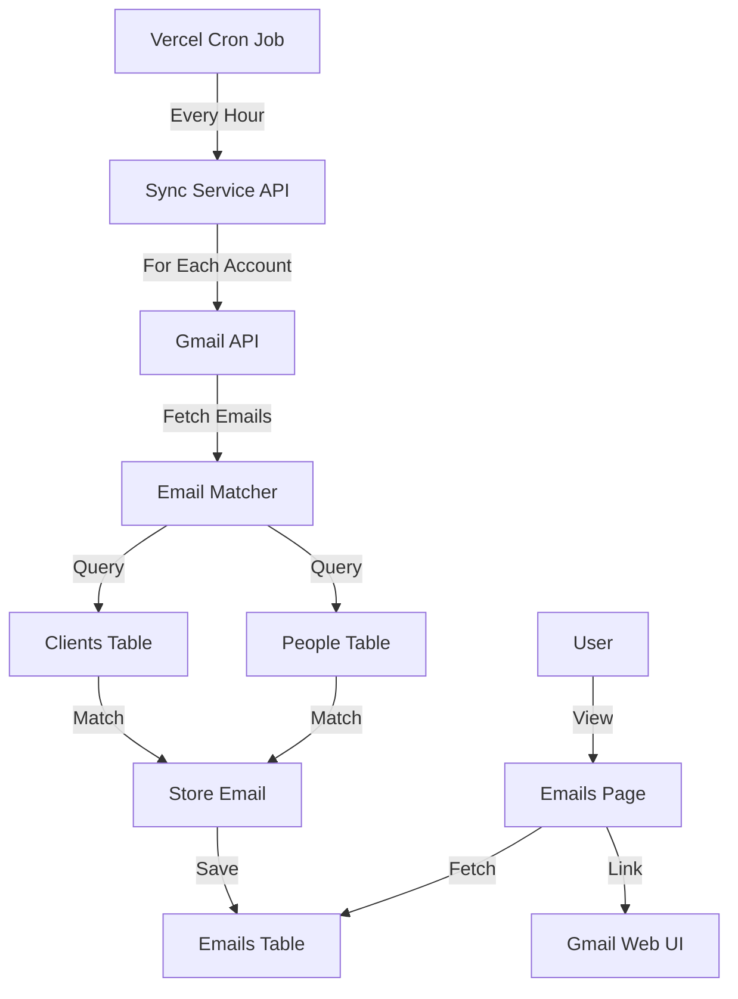

# Gmail Integration Implementation Plan

## Overview

Connect the hub app to 7 corporate Gmail accounts, sync emails hourly, match them to clients/people in the database, and display email summaries in a dedicated emails page.

## Architecture




## Database Schema Changes

### New Tables

**1. `gmail_accounts` table** - Store OAuth credentials for each corporate account

- `id` (SERIAL PRIMARY KEY)
- `email` (VARCHAR(255) UNIQUE) - The Gmail account email
- `access_token` (TEXT) - Encrypted OAuth access token
- `refresh_token` (TEXT) - Encrypted OAuth refresh token
- `token_expires_at` (TIMESTAMP) - When access token expires
- `last_sync_at` (TIMESTAMP) - Last successful sync timestamp
- `is_active` (BOOLEAN DEFAULT true) - Whether account is enabled for syncing
- `created_at` (TIMESTAMP)
- `updated_at` (TIMESTAMP)

**2. `emails` table** - Store synced email metadata

- `id` (SERIAL PRIMARY KEY)
- `gmail_account_id` (INTEGER REFERENCES gmail_accounts)
- `gmail_message_id` (VARCHAR(255) UNIQUE) - Gmail's message ID
- `thread_id` (VARCHAR(255)) - Gmail thread ID
- `client_id` (INTEGER REFERENCES clients) - Matched client (nullable)
- `person_id` (INTEGER REFERENCES people) - Matched person (nullable)
- `from_email` (VARCHAR(255)) - Sender email address
- `from_name` (VARCHAR(255)) - Sender display name
- `subject` (TEXT) - Email subject
- `snippet` (TEXT) - Email preview snippet
- `date` (TIMESTAMP) - Email date/time
- `gmail_url` (TEXT) - Link to view email in Gmail
- `created_at` (TIMESTAMP)
- `updated_at` (TIMESTAMP)

**Indexes:**

- `idx_emails_client_id` on `client_id`
- `idx_emails_person_id` on `person_id`
- `idx_emails_from_email` on `from_email`
- `idx_emails_date` on `date DESC`
- `idx_emails_gmail_message_id` on `gmail_message_id`

## Implementation Steps

### 1. Database Setup

- **File**: `hub/src/db/schema.sql`
- Add migration SQL for `gmail_accounts` and `emails` tables
- Create database functions/types in `hub/src/lib/db/gmail-accounts.ts` and `hub/src/lib/db/emails.ts`

### 2. Gmail API Integration

- **Dependencies**: Add `googleapis` npm package
- **File**: `hub/src/lib/gmail/client.ts`
- Create Gmail API client wrapper with:
- OAuth2 client initialization
- Token refresh logic
- Email fetching with pagination
- Rate limit handling

### 3. OAuth Flow for Account Connection

- **Files**: 
- `hub/src/app/api/gmail/connect/route.ts` - Initiate OAuth flow
- `hub/src/app/api/gmail/callback/route.ts` - Handle OAuth callback
- `hub/src/app/gmail/connect/page.tsx` - UI for connecting accounts
- Implement Google OAuth 2.0 flow:
- Generate authorization URL
- Handle callback with authorization code
- Exchange for tokens
- Store encrypted tokens in database

### 4. Email Matching Logic

- **File**: `hub/src/lib/gmail/matcher.ts`
- Function to match sender email to:
- `clients.email` (exact match)
- `people.email` (exact match, then link via `person.client_id`)
- Handle email normalization (lowercase, trim)
- Return matched `client_id` and `person_id` (if applicable)

### 5. Email Sync Service

- **File**: `hub/src/app/api/gmail/sync/route.ts`
- Background service that:
- Fetches all active Gmail accounts
- For each account:
    - Refresh token if expired
    - Query Gmail API for new emails since `last_sync_at`
    - Match each email to clients/people
    - Store email metadata in database
    - Update `last_sync_at`
- Handle errors gracefully (log, continue with next account)

### 6. Vercel Cron Configuration

- **File**: `vercel.json`
- Add cron job to trigger sync every hour:
  ```json
          "crons": [{
            "path": "/api/gmail/sync",
            "schedule": "0 * * * *"
          }]
  ```


### 7. Email Management API

- **Files**:
- `hub/src/app/api/gmail/accounts/route.ts` - List/manage accounts
- `hub/src/app/api/gmail/accounts/[id]/route.ts` - Update/delete account
- `hub/src/app/api/emails/route.ts` - List emails with filtering
- `hub/src/app/api/emails/[id]/route.ts` - Get single email

### 8. Emails UI Page

- **File**: `hub/src/app/emails/page.tsx`
- Display:
- List of emails with client name, subject, snippet, date
- Filter by client, date range
- Link to view full email in Gmail
- Pagination
- **Component**: `hub/src/components/emails-table.tsx`
- Similar structure to existing `clients-table.tsx`

### 9. Account Management UI

- **File**: `hub/src/app/gmail/accounts/page.tsx`
- Display connected accounts
- Add/remove account buttons
- Show sync status, last sync time

### 10. Navigation Updates

- **File**: `hub/src/components/navigation.tsx`
- Add "Emails" link to navigation menu

## Security Considerations

- **Token Encryption**: Store OAuth tokens encrypted (use environment variable for encryption key)
- **Environment Variables**: Add `GOOGLE_CLIENT_ID`, `GOOGLE_CLIENT_SECRET`, `GOOGLE_REDIRECT_URI`
- **API Route Protection**: Ensure sync endpoint is protected (Vercel Cron secret or API key)

## Key Files to Create/Modify

**New Files:**

- `hub/src/db/schema.sql` (additions)
- `hub/src/lib/db/gmail-accounts.ts`
- `hub/src/lib/db/emails.ts`
- `hub/src/lib/gmail/client.ts`
- `hub/src/lib/gmail/matcher.ts`
- `hub/src/app/api/gmail/connect/route.ts`
- `hub/src/app/api/gmail/callback/route.ts`
- `hub/src/app/api/gmail/sync/route.ts`
- `hub/src/app/api/gmail/accounts/route.ts`
- `hub/src/app/api/gmail/accounts/[id]/route.ts`
- `hub/src/app/api/emails/route.ts`
- `hub/src/app/api/emails/[id]/route.ts`
- `hub/src/app/emails/page.tsx`
- `hub/src/app/gmail/accounts/page.tsx`
- `hub/src/components/emails-table.tsx`

**Modified Files:**

- `hub/package.json` (add `googleapis` dependency)
- `hub/src/components/navigation.tsx` (add Emails link)
- `vercel.json` (add cron configuration)

## Testing Strategy

1. Test OAuth flow with single account
2. Test email matching logic with sample emails
3. Test sync service with mock Gmail API responses
4. Test UI with sample data