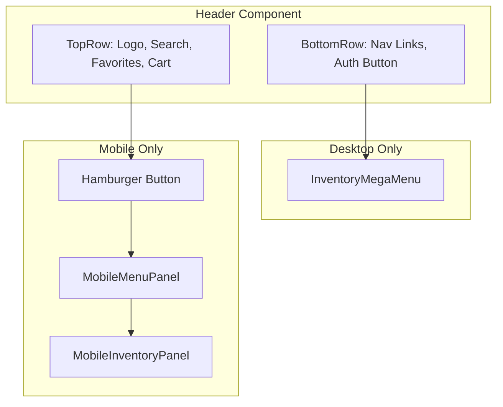

# Header Redesign Implementation Plan

## Overview

Redesign the header to match the provided mockups with:

- **Desktop**: Two-row layout with mega-menu inventory dropdown
- **Mobile**: Hamburger menu with full-screen slide-over panels and nested navigation

---

## Architecture



---

## Step 1: Create Navigation Config

Create [`lib/config/navigation.ts`](website/lib/config/navigation.ts) with hardcoded navigation data:

```typescript
export const NAV_ITEMS = [
  { title: "About EAG", href: "/about" },
  { title: "Inventory", href: "/vehicles", hasSubmenu: true },
  { title: "Services", href: "/services" },
  { title: "Sell your car", href: "/sell" },
  { title: "Under the hood", href: "/blog" },
  { title: "EAG Collection", href: "/collection" },
  { title: "Parts", href: "/search" },
  { title: "Merchandise", href: "/merch" },
  { title: "Contact", href: "/contact" },
];

export const INVENTORY_MENU = {
  quickLinks: [
    { title: "Current inventory", href: "/vehicles" },
    { title: "Previously sold", href: "/vehicles?status=sold" },
    { title: "Incoming", href: "/vehicles?status=incoming" },
    { title: "Sell your car", href: "/sell" },
  ],
  chassisCodes: [
    { category: "Column 1", items: ["G8X", "F87", "E46", "E30"] },
    { category: "Column 2", items: ["Z8", "F8X", "E39", "E28"] },
    { category: "Column 3", items: ["Z4", "E9X", "E36", "E24"] },
    { category: "Column 4", items: ["Z3", "E60", "E34"] },
  ],
};
```

---

## Step 2: Create New Header Component

Create [`components/shared/Header.tsx`](website/components/shared/Header.tsx) as the main header:**Structure:**

- **Top Row** (both mobile and desktop):
- Logo (left)
- Search bar (desktop only, center-right)
- Favorites badge (desktop only)
- Cart badge (both)
- Hamburger button (mobile only)
- **Bottom Row** (desktop only):
- Navigation links from `NAV_ITEMS`
- "Sign in with Google" button (logged out) or "Account | Favorites" (logged in)

---

## Step 3: Create Desktop Inventory Mega-Menu

Create [`components/shared/InventoryMegaMenu.tsx`](website/components/shared/InventoryMegaMenu.tsx):**Features:**

- Triggered on hover/click of "Inventory" nav item
- Full-width dropdown panel below navigation bar
- Left section: Quick links (Current inventory, Previously sold, etc.)
- Right section: 4-column grid of chassis codes
- Close button
- Click outside to close
- Smooth slide-down animation

---

## Step 4: Create Mobile Menu Slide-Over

Replace [`components/shared/MobileMenu.tsx`](website/components/shared/MobileMenu.tsx) with new design:**Main Panel Features:**

- Logo (flag icon only) + X close button in header
- Full list of navigation items
- "Inventory" item shows right chevron arrow indicating submenu
- Separator line before Account/Favorites
- Dark background (#0f0f0f or similar)
- Slide-in from left animation

---

## Step 5: Create Mobile Inventory Panel

Create [`components/shared/MobileInventoryPanel.tsx`](website/components/shared/MobileInventoryPanel.tsx):**Features:**

- Logo + "ENTHUSIAST AUTO" text + X close button
- "< Back to main menu" button at top
- Scrollable list of all inventory items:
- Quick links section
- Model categories (M1, M2, M3, M5, Z3/Z4) as headers
- Chassis codes as sub-items
- Slide-in animation (stacked on top of main panel)

---

## Step 6: Update Auth UI

Modify [`components/shared/UserMenu.tsx`](website/components/shared/UserMenu.tsx):**Logged Out State:**

- Desktop: "Sign in with Google" button with Google icon
- Mobile: "Account" link in menu

**Logged In State:**

- Desktop: Avatar + "Account | Favorites" text links
- Mobile: "Account" and "Favorites" as separate menu items

---

## Step 7: Create Favorites Badge Component

Create [`components/shared/FavoritesBadge.tsx`](website/components/shared/FavoritesBadge.tsx):

- Star/heart outline icon
- Badge with count (fetched from user's favorites)
- Links to `/account/garage`

---

## Step 8: Update Layout Integration

Modify [`app/layout.tsx`](website/app/layout.tsx):

- Replace `<Navigation />` with new `<Header />`

---

## Files to Create

| File | Purpose |

|------|---------|

| `lib/config/navigation.ts` | Navigation items and inventory menu data |

| `components/shared/Header.tsx` | Main header component |

| `components/shared/InventoryMegaMenu.tsx` | Desktop mega-menu dropdown |

| `components/shared/MobileInventoryPanel.tsx` | Mobile inventory submenu |

| `components/shared/FavoritesBadge.tsx` | Favorites icon with count |

## Files to Modify

| File | Changes |

|------|---------|

| `components/shared/MobileMenu.tsx` | Complete redesign for new panel layout |

| `components/shared/UserMenu.tsx` | Add Google sign-in button, update logged-in UI |

| `app/layout.tsx` | Swap Navigation for Header |

## Files to Delete (after migration)

| File | Reason |

|------|---------|

| `components/shared/Navigation.tsx` | Replaced by Header.tsx |

| `components/shared/InventoryDropdown.tsx` | Replaced by InventoryMegaMenu.tsx |

| `components/shared/NavLink.tsx` | Inline into new components or keep if useful |---

## Responsive Breakpoints

- **Mobile**: < 1024px (lg breakpoint) - Show hamburger, hide nav bar
- **Desktop**: >= 1024px - Show full two-row header with navigation

---

## Animation Details

- **Mega-menu**: Slide down with fade (200ms ease-out)
- **Mobile panel**: Slide from left (300ms ease-in-out)