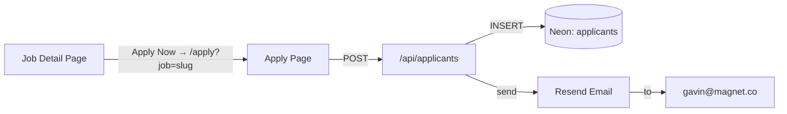

# Job Application Page

## Architecture

## Database Schema

Create `applicants` table with columns:
- `id` (serial primary key)
- `job_id` (text, required) - references job slug
- `first_name`, `last_name` (text, required)
- `email` (text, required)
- `cell_number` (text, required)
- `linkedin_url` (text, required)
- `resume_url` (text, optional)
- `timezone` (text, required)
- `location_preference` (text, required)
- `created_at`, `updated_at` (timestamps)

## Files to Create

| File | Purpose |
|------|---------|
| [`website/src/app/apply/page.tsx`](website/src/app/apply/page.tsx) | Apply page with job dropdown + form |
| [`website/src/app/api/applicants/route.ts`](website/src/app/api/applicants/route.ts) | API route to save applicant and send email |
| [`website/src/lib/email/templates/application-form.ts`](website/src/lib/email/templates/application-form.ts) | HTML email template for applications |

## Files to Modify

| File | Change |
|------|--------|
| [`website/src/lib/email/resend.ts`](website/src/lib/email/resend.ts) | Add `sendApplicationEmail` function |
| [`website/src/data/jobs.tsx`](website/src/data/jobs.tsx) | Update `applyUrl` to `/apply?job={id}` for all jobs |

## Apply Page Layout

Two-column layout matching the existing job detail style:
- **Left column**: Job position dropdown (pre-selected via `?job=` query param)
- **Right column**: Form fields in a styled card
  - First name, Last name (row)
  - Email address
  - Cell number
  - LinkedIn URL
  - Resume/Portfolio URL (optional)
  - Timezone dropdown
  - Location preference dropdown (populated from selected job's locations)

## Implementation Notes

- Reuse existing form components: `Input`, `Select`, `Label`, `Button` from [`website/src/components/elements/`](website/src/components/elements/)
- Follow the contact form pattern in [`hero-with-contact-form.tsx`](website/src/components/sections/hero-with-contact-form.tsx) for form state management
- Email template follows the branded style from [`contact-form.ts`](website/src/lib/email/templates/contact-form.ts)