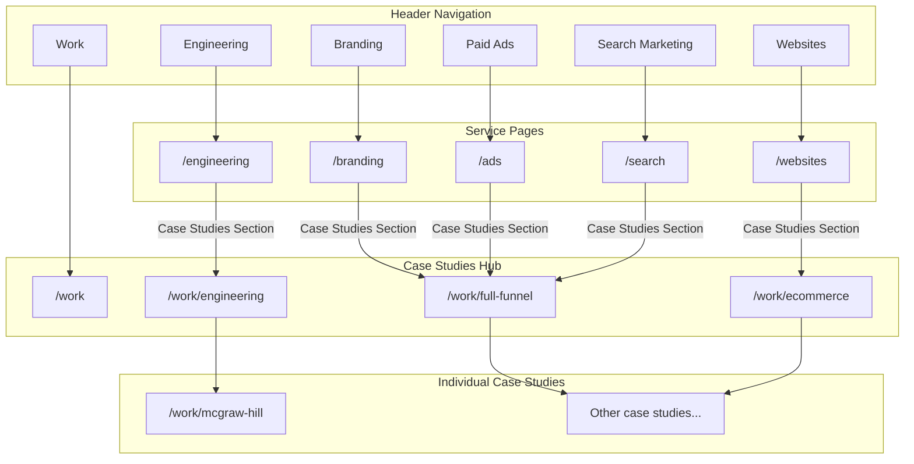

# Link Case Studies to Service Pages

## Overview

Add case study sections to all service pages and create a new standalone Engineering service page. Users will discover case studies through the service pages they're interested in, with "Work" remaining in the header as a secondary hub.

---

## Navigation Changes

Update [website/src/app/layout.tsx](website/src/app/layout.tsx):

**Header Nav** (add Engineering):
```tsx
<NavbarLink href="/work">Work</NavbarLink>
<NavbarLink href="/engineering">Engineering</NavbarLink>  // NEW
<NavbarLink href="/branding">Branding</NavbarLink>
<NavbarLink href="/websites">Websites</NavbarLink>
<NavbarLink href="/ads">Paid Ads</NavbarLink>
<NavbarLink href="/search">Search Marketing</NavbarLink>
```

**Footer** (add Engineering to Services):
```tsx
<FooterCategory title="Services">
  <FooterLink href="/engineering">Engineering</FooterLink>
  <FooterLink href="/websites">Websites</FooterLink>
  <FooterLink href="/branding">Branding</FooterLink>
  <FooterLink href="/search">Search Marketing</FooterLink>
  <FooterLink href="/ads">Paid Ads</FooterLink>
</FooterCategory>
```

---

## New Engineering Service Page

Create [website/src/app/engineering/page.tsx](website/src/app/engineering/page.tsx):

A dedicated service page for full-stack engineering work, following the same structure as other service pages:

**Sections:**
1. Hero with TabbedLogoGallery (McGraw Hill, HGTV, IKEA, Expedia, UCLA)
2. Capabilities (FeaturesBentoGrid) - Platform Engineering, Full-Stack Dev, API Design, etc.
3. Pricing section (create new `PricingEngineering` component or inline)
4. Process section (`ServiceProcess` with service="engineering")
5. Stats section
6. **Case Studies section** - Featured engineering projects with links to `/work/mcgraw-hill`, etc.
7. Testimonial
8. FAQs
9. CTA

---

## Create Reusable Case Studies Section Component

Create [website/src/components/sections/case-studies-preview.tsx](website/src/components/sections/case-studies-preview.tsx):

A reusable section component that displays 2-3 featured case studies with a "View all" link:

```tsx
interface CaseStudiesPreviewProps {
  eyebrow?: string
  headline: string
  subheadline?: ReactNode
  caseStudies: CaseStudy[]
  viewAllHref: string
  viewAllText?: string
}
```

This component will be used on all service pages.

---

## Add Case Studies to Each Service Page

### 1. Websites Page ([website/src/app/websites/page.tsx](website/src/app/websites/page.tsx))
- Add `CaseStudiesPreview` section after Process, before Stats
- Filter case studies that include "Website" or "E-commerce Platform" in services
- Link to `/work` or `/work/ecommerce`

### 2. Branding Page ([website/src/app/branding/page.tsx](website/src/app/branding/page.tsx))
- Add `CaseStudiesPreview` section after Process, before Stats
- Filter case studies that include "Brand Strategy" in services
- Link to `/work/full-funnel`

### 3. Paid Ads Page ([website/src/app/ads/page.tsx](website/src/app/ads/page.tsx))
- Add `CaseStudiesPreview` section after Process, before Stats
- Filter case studies that include "Paid Media" in services
- Link to `/work/full-funnel`

### 4. Search Marketing Page ([website/src/app/search/page.tsx](website/src/app/search/page.tsx))
- Add `CaseStudiesPreview` section after Process, before Stats
- Filter case studies that include "Search Marketing" in services
- Link to `/work/full-funnel`

### 5. Engineering Page (new)
- Add `CaseStudiesPreview` section with engineering case studies
- Link to `/work/engineering`

---

## Update Case Studies Data

Add service tags to [website/src/lib/case-studies/data.ts](website/src/lib/case-studies/data.ts) to enable filtering:

```typescript
// Add helper function to get case studies by service
export function getCaseStudiesByService(service: string): CaseStudy[] {
  return allCaseStudies.filter((cs) => 
    cs.services.some(s => s.toLowerCase().includes(service.toLowerCase()))
  )
}
```

---

## File Changes Summary

| File | Action |
|------|--------|
| `website/src/app/layout.tsx` | Add Engineering to nav |
| `website/src/app/engineering/page.tsx` | Create new page |
| `website/src/components/sections/case-studies-preview.tsx` | Create new component |
| `website/src/components/sections/service-process.tsx` | Add "engineering" service type |
| `website/src/app/websites/page.tsx` | Add case studies section |
| `website/src/app/branding/page.tsx` | Add case studies section |
| `website/src/app/ads/page.tsx` | Add case studies section |
| `website/src/app/search/page.tsx` | Add case studies section |
| `website/src/lib/case-studies/data.ts` | Add service filter helper |

---

## Page Flow Diagram

