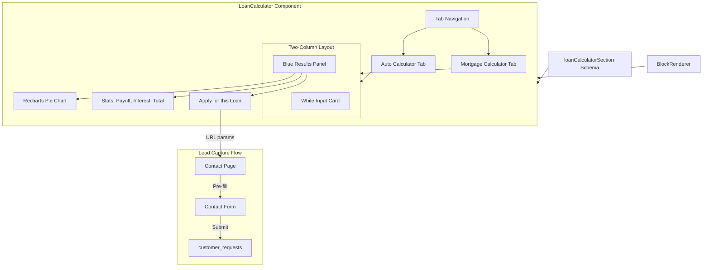
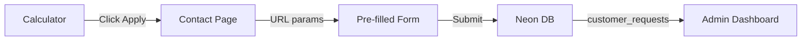

# Loan Calculator Redesign

This plan converts the existing dark-themed `MortgageCalculator` component into a light-themed `LoanCalculator` with tabbed Auto and Mortgage calculators matching the Figma design.

## Current vs Target

| Aspect | Current | Target (Figma) |

|--------|---------|----------------|

| Theme | Dark (purple/pink gradients) | Light (white cards, blue results) |

| Calculators | Mortgage only | Auto + Mortgage (tabbed) |

| Visualization | None | Recharts pie chart with hover tooltips |

| Amortization | None | Table with Monthly/Yearly toggle |

| Results display | Payment breakdown list | Blue section with stats cards |

| Lead capture | None | Apply button → pre-filled contact form → Neon DB |

## Architecture



## Files to Modify

- [`website/app/components/sections/MortgageCalculator.tsx`](website/app/components/sections/MortgageCalculator.tsx) - Rename and redesign
- [`studio/src/schemaTypes/objects/mortgageCalculatorSection.ts`](studio/src/schemaTypes/objects/mortgageCalculatorSection.ts) - Rename and extend schema
- [`studio/src/schemaTypes/index.ts`](studio/src/schemaTypes/index.ts) - Update export
- [`website/app/components/layout/BlockRenderer.tsx`](website/app/components/layout/BlockRenderer.tsx) - Update import and case
- [`website/app/contact/ContactPageContent.tsx`](website/app/contact/ContactPageContent.tsx) - Add URL param parsing and pre-fill logic

## Implementation Details

### 1. Component Rename and Structure

Rename `MortgageCalculator.tsx` to `LoanCalculator.tsx` and restructure:

```tsx
// New component structure
export default function LoanCalculator({ block, rates }) {
  const [activeTab, setActiveTab] = useState<'auto' | 'mortgage'>('auto')
  
  return (
    <SectionWrapper theme="light" background="sand-light">
      {/* Header: "Estimate Your Payments" */}
      {/* Tab Navigation */}
      {/* Two-column grid: Input Card | Results Panel */}
      {/* Amortization Table (expandable) */}
      {/* Disclaimer */}
    </SectionWrapper>
  )
}
```

### 2. Tab Navigation

Simple tab buttons with active state indicator:

```tsx
<div className="flex gap-8 border-b border-sand-dark">
  <button className={activeTab === 'auto' ? 'border-b-2 border-skyline' : ''}>
    Auto Calculator
  </button>
  <button className={activeTab === 'mortgage' ? 'border-b-2 border-skyline' : ''}>
    Mortgage Calculator
  </button>
</div>
```

### 3. Auto Calculator Logic

New calculation function for auto/RV loans (simpler than mortgage - no taxes/insurance):

- **Inputs**: Loan Amount, Interest Rate, Term (months), Down Payment, Trade-in Value
- **Formula**: Standard amortization (Principal - Down Payment - Trade-in)
- **Outputs**: Monthly Payment, Total Interest, Total to Repaid, Payoff Date

### 4. Recharts Pie Chart

Install Recharts and create an interactive donut chart with hover tooltips:

```bash
npm install recharts
```
```tsx
import { PieChart, Pie, Cell, Tooltip, ResponsiveContainer } from 'recharts'

function PaymentBreakdownChart({ principal, interest }: { principal: number; interest: number }) {
  const data = [
    { name: 'Principal', value: principal, color: '#3db3e3' },  // skyline
    { name: 'Interest', value: interest, color: '#c7a8e0' },    // lilac
  ]

  return (
    <ResponsiveContainer width="100%" height={200}>
      <PieChart>
        <Pie
          data={data}
          cx="50%"
          cy="50%"
          innerRadius={50}
          outerRadius={80}
          dataKey="value"
          stroke="none"
        >
          {data.map((entry, index) => (
            <Cell key={index} fill={entry.color} />
          ))}
        </Pie>
        <Tooltip
          formatter={(value: number) => `$${value.toLocaleString()}`}
          contentStyle={{
            backgroundColor: '#133351',
            border: 'none',
            borderRadius: '8px',
            color: 'white',
          }}
        />
      </PieChart>
    </ResponsiveContainer>
  )
}
```

**Recharts benefits:**

- `<Tooltip>` provides built-in hover interactivity showing exact values
- `<ResponsiveContainer>` makes chart responsive
- `innerRadius` creates donut style matching Figma
- Smooth animations on data changes
- Accessible by default

### 5. Light Theme Styling

Replace dark theme classes with light theme:

| Element | Old Classes | New Classes |

|---------|-------------|-------------|

| Section | `bg-calc-bg` | `bg-lightest-blue` or `bg-sand-light` |

| Input Card | `bg-calc-card border-white/10` | `bg-white shadow-lg border-sand-dark/20` |

| Results Panel | Purple gradient | `bg-irreantum` (dark blue) |

| Text | `text-white` | `text-irreantum` (inputs), `text-white` (results) |

| Accents | Pink/purple gradient | `bg-skyline` (teal buttons) |

### 6. Results Panel Design (Figma Match)

```tsx
<div className="rounded-xl bg-irreantum p-6">
  {/* Header text */}
  <p className="text-white/80">Find a car payment to fit your budget...</p>
  
  {/* Monthly Payment */}
  <div className="text-4xl font-bold text-white">${monthlyPayment}</div>
  
  {/* CTA Button */}
  <Button className="bg-irreantum border border-white">Apply for this loan</Button>
  
  {/* Pie Chart + Legend */}
  <PieChart principal={...} interest={...} />
  
  {/* Stats Row */}
  <div className="grid grid-cols-3 gap-4 bg-darkest/50 rounded-lg p-4">
    <div>Estimated payoff date: {date}</div>
    <div>Total interest: ${interest}</div>
    <div>Total to be repaid: ${total}</div>
  </div>
</div>
```

### 7. Amortization Table

Add collapsible table with toggle:

```tsx
const [tableView, setTableView] = useState<'monthly' | 'yearly'>('yearly')
const [showTable, setShowTable] = useState(false)

// Generate amortization schedule
const schedule = calculateAmortizationSchedule(principal, rate, term)

// Aggregate by year if yearly view
const displayData = tableView === 'yearly' 
  ? aggregateByYear(schedule) 
  : schedule
```

Table columns: Year/Month, Beginning Balance, Principal, Interest, Payment, Ending Balance

### 8. Sanity Schema Updates

Rename and extend `mortgageCalculatorSection.ts` to `loanCalculatorSection.ts`:

```ts
export const loanCalculatorSection = defineType({
  name: 'loanCalculatorSection',
  title: 'Loan Calculator',
  // ... existing fields plus:
  defineField({
    name: 'defaultTab',
    title: 'Default Tab',
    type: 'string',
    options: { list: ['auto', 'mortgage'] },
    initialValue: 'auto',
  }),
  defineField({
    name: 'autoCalculatorTitle',
    title: 'Auto Calculator Title',
    type: 'string',
    initialValue: 'Auto & RV Calculator',
  }),
  defineField({
    name: 'showAmortizationTable',
    title: 'Show Amortization Table',
    type: 'boolean',
    initialValue: true,
  }),
})
```

### 9. Lead Capture Flow ("Apply for this Loan")

The "Apply for this loan" button creates a seamless journey from calculator to contact form to lead capture.

**Flow Diagram:**



**Button Implementation:**

```tsx
// In LoanCalculator.tsx
const handleApplyClick = () => {
  const params = new URLSearchParams({
    type: activeTab, // 'auto' or 'mortgage'
    amount: String(loanAmount),
    term: String(loanTerm),
    rate: String(interestRate),
    payment: String(monthlyPayment.toFixed(2)),
    downPayment: String(downPayment),
    ...(activeTab === 'auto' && { tradeIn: String(tradeInValue) }),
  })
  
  window.location.href = `/contact?loan=${params.toString()}`
}

// Button styled per Figma (sunset/gold with dark text)
<button
  onClick={handleApplyClick}
  className="rounded-full bg-sunset px-6 py-3 font-semibold text-irreantum hover:bg-sunset/90"
>
  Apply for this loan <ArrowRightIcon className="ml-2 inline h-4 w-4" />
</button>
```

**Contact Page Updates** ([`ContactPageContent.tsx`](website/app/contact/ContactPageContent.tsx)):

1. Add new inquiry types for loan applications:
```tsx
const INQUIRY_TYPES = [
  // ... existing types
  { value: 'auto-loan-application', label: 'Auto/RV Loan Application' },
  { value: 'mortgage-application', label: 'Mortgage Application' },
]
```

2. Parse URL params and pre-fill form on mount:
```tsx
useEffect(() => {
  const searchParams = new URLSearchParams(window.location.search)
  const loanParams = searchParams.get('loan')
  
  if (loanParams) {
    const loan = new URLSearchParams(loanParams)
    const loanType = loan.get('type')
    const amount = loan.get('amount')
    const term = loan.get('term')
    const rate = loan.get('rate')
    const payment = loan.get('payment')
    const downPayment = loan.get('downPayment')
    const tradeIn = loan.get('tradeIn')
    
    // Build pre-filled message
    const isAuto = loanType === 'auto'
    const message = `I'm interested in applying for ${isAuto ? 'an auto/RV loan' : 'a mortgage'} with the following details:

Loan Amount: $${Number(amount).toLocaleString()}
${downPayment ? `Down Payment: $${Number(downPayment).toLocaleString()}` : ''}
${tradeIn ? `Trade-in Value: $${Number(tradeIn).toLocaleString()}` : ''}
Loan Term: ${term} ${isAuto ? 'months' : 'years'}
Interest Rate: ${rate}%
Estimated Monthly Payment: $${Number(payment).toLocaleString()}

Please contact me to discuss my options.`

    setFormData(prev => ({
      ...prev,
      inquiryType: isAuto ? 'auto-loan-application' : 'mortgage-application',
      message,
    }))
    
    // Scroll to the contact form
    document.getElementById('contact-form')?.scrollIntoView({ behavior: 'smooth' })
  }
}, [])
```

3. Store loan details as structured metadata:
```tsx
// In handleFormSubmit, add loan_details to the API call
const response = await fetch('/api/admin/leads', {
  method: 'POST',
  body: JSON.stringify({
    ...formData,
    source: loanParams ? 'loan_calculator' : 'contact_form',
    source_page: loanParams ? '/loan-calculator' : '/contact',
    // Store structured loan details for easy filtering/reporting
    service_product: loanParams ? JSON.stringify({
      type: loan.get('type'),
      amount: loan.get('amount'),
      term: loan.get('term'),
      rate: loan.get('rate'),
      payment: loan.get('payment'),
    }) : null,
  }),
})
```


**UX Enhancements:**

- Show a banner on the contact page when pre-filled: "We've pre-filled your loan details below. Please review and add your contact information."
- Auto-scroll to the contact form section
- Highlight the pre-filled message field briefly (subtle animation)

**Data stored in `customer_requests`:**

| Field | Value |

|-------|-------|

| `source` | `loan_calculator` |

| `source_page` | `/loan-calculator` or page where calculator is embedded |

| `service_category` | `auto-loan-application` or `mortgage-application` |

| `service_product` | JSON with loan details |

| `message` | Human-readable summary of loan request |

## Migration Notes

- The schema rename (`mortgageCalculatorSection` to `loanCalculatorSection`) requires updating any existing Sanity documents that use this section type
- Existing pages with the mortgage calculator will need their content updated in Sanity Studio

## Testing Checklist

- [ ] Auto calculator computes correct monthly payments
- [ ] Mortgage calculator retains current functionality
- [ ] Tab switching works correctly
- [ ] Pie chart renders with correct proportions and hover tooltips show values
- [ ] Amortization table shows correct values
- [ ] Monthly/Yearly toggle works
- [ ] Mobile responsive layout
- [ ] Light theme matches Figma design
- [ ] CTA buttons link correctly
- [ ] "Apply for this loan" redirects to /contact with correct URL params
- [ ] Contact form pre-fills with loan details from URL
- [ ] Pre-filled form shows informational banner
- [ ] Submitted lead appears in customer_requests with correct source and structured data
- [ ] Auto-scroll to contact form works smoothly