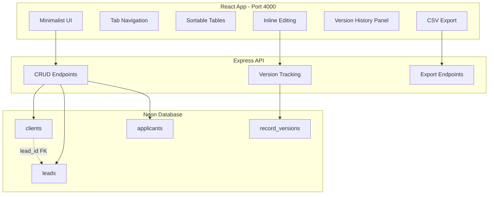

# Magnet Data - Database Management App

## Architecture




## Database Schema

**New `clients` table:**

- `id`, `name`, `company`, `email`, `phone`, `status` (lead/active/churned/paused)
- `contract_start`, `contract_value`, `industry`, `notes`
- `lead_id` (FK to leads - nullable, links converted leads)
- `created_at`, `updated_at`

**New `record_versions` table** (for version tracking):

- `id`, `table_name`, `record_id`, `field_name`, `old_value`, `new_value`
- `changed_by`, `changed_at`

## Tech Stack

- **Frontend:** React 18 + Vite + TypeScript + TailwindCSS
- **Backend:** Express.js API (same process, serves both)
- **Styling:** Match website colors (oxblood `#220002`, snow `#F5F7F7`, ember `#F9432B`, basalt `#2A4144`)
- **Fonts:** Geist Sans/Mono (copy from website)

## Project Structure

```javascript
/data/
├── package.json
├── vite.config.ts
├── tailwind.config.js
├── src/
│   ├── main.tsx
│   ├── App.tsx
│   ├── index.css (brand colors)
│   ├── components/
│   │   ├── TableView.tsx (sortable table with inline edit)
│   │   ├── TabNav.tsx
│   │   ├── EditableCell.tsx
│   │   ├── VersionHistory.tsx
│   │   └── ExportButton.tsx
│   └── lib/
│       └── api.ts
└── server/
    ├── index.ts (Express server)
    ├── db.ts (Neon connection)
    └── routes/
        ├── clients.ts
        ├── leads.ts
        ├── applicants.ts
        └── versions.ts
```


## Key Features

1. **Tab Navigation** - Switch between Clients, Leads, Applicants tables
2. **Sortable Columns** - Click column headers to sort asc/desc
3. **Inline Editing** - Click any cell to edit, blur or Enter saves
4. **Version Tracking** - Every edit logged with old/new values, timestamp
5. **Version Reversion** - Click any version to revert field to that value
6. **CSV Export** - One button per table, downloads full table as CSV
7. **Lead → Client Conversion** - Button on leads to create linked client

## Migration Files

Create in [`website/src/lib/db/migrations/`](website/src/lib/db/migrations/):

- `003_create_clients.sql` - clients table with lead_id FK