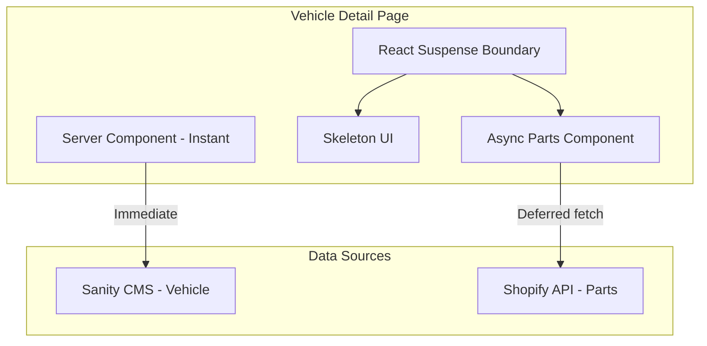

# My Garage: Vehicle PDP Popular Parts Enhancement

## Current State

The vehicle detail page at [`website/app/vehicles/[slug]/page.tsx`](website/app/vehicles/[slug]/page.tsx) currently:
- Fetches compatible parts **synchronously** via `getCompatibleParts(vehicle)` (line 119)
- Blocks page render while waiting for Shopify API
- Uses tag-based matching but does **not** sort by popularity

## Architecture



## Implementation Plan

### 1. Create Popular Parts API Function

Add a new function in [`website/lib/shared/recommendations.ts`](website/lib/shared/recommendations.ts) that:
- Queries Shopify with `sortKey: BEST_SELLING` for compatible parts
- Falls back to tag-based matching with popularity weighting
- Returns 5-10 parts (configurable limit)

```typescript
export async function getPopularCompatibleParts(
  vehicle: VehicleDetail,
  limit: number = 8
): Promise<Product[]>
```

### 2. Create Deferred Parts Component

Create a new server component that fetches parts asynchronously:

**New file:** `website/components/vehicles/CompatiblePartsSection.tsx`

- Server component that calls `getPopularCompatibleParts()`
- Wrapped in Suspense with skeleton fallback in the parent page
- Shows 5-10 parts in a responsive grid

### 3. Create Skeleton Component

**New file:** `website/components/vehicles/CompatiblePartsSkeleton.tsx`

- Matches the grid layout of the parts section
- 4-8 skeleton cards with animated pulse effect
- Provides instant visual feedback while parts load

### 4. Update Vehicle Detail Page

Modify [`website/app/vehicles/[slug]/page.tsx`](website/app/vehicles/[slug]/page.tsx):

- Remove synchronous `getCompatibleParts()` call
- Wrap `CompatiblePartsSection` in React Suspense
- Use skeleton as fallback

```tsx
<Suspense fallback={<CompatiblePartsSkeleton />}>
  <CompatiblePartsSection vehicle={vehicle} limit={8} />
</Suspense>
```

### 5. Update Roadmap

Add new section to [`context/ROADMAP.md`](context/ROADMAP.md) under "Planned" documenting this feature for My Garage enhancement.

## Files to Modify

| File | Change |
|------|--------|
| `website/lib/shared/recommendations.ts` | Add `getPopularCompatibleParts()` with BEST_SELLING sort |
| `website/components/vehicles/CompatiblePartsSection.tsx` | New async server component |
| `website/components/vehicles/CompatiblePartsSkeleton.tsx` | New skeleton UI component |
| `website/app/vehicles/[slug]/page.tsx` | Use Suspense for deferred loading |
| `context/ROADMAP.md` | Document feature in roadmap |

## Popularity Strategy

Use Shopify's native `BEST_SELLING` sort key combined with tag filtering:

```graphql
products(sortKey: BEST_SELLING, query: $tagQuery, first: 10) {
  edges { node { ...product } }
}
```

This leverages Shopify's sales data for popularity without requiring custom tracking infrastructure.