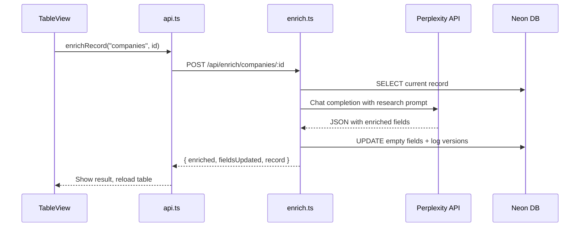

# Perplexity Data Enrichment Feature

## Architecture

## Implementation

### 1. Create enrichment route

Create [`data/server/routes/enrich.ts`](data/server/routes/enrich.ts) with:
- `queryPerplexity()` helper that calls the Sonar API
- `POST /companies/:id` - researches company, updates industry/size/notes
- `POST /people/:id` - researches person, updates title/notes
- Only updates fields that are currently empty (preserves manual data)
- Logs all changes via existing `logVersion()` for audit trail

### 2. Register route in server

Update [`data/server/index.ts`](data/server/index.ts) to import and mount the enrichment router at `/api/enrich`.

### 3. Add API client function

Add `enrichRecord()` function to [`data/src/lib/api.ts`](data/src/lib/api.ts) that POSTs to the enrichment endpoint and returns the result.

### 4. Add enrich button to table rows

Update [`data/src/components/TableView.tsx`](data/src/components/TableView.tsx):
- Add `enriching` state to track which row is being enriched
- Add `handleEnrich()` handler that calls the API and reloads data
- Render lightning bolt button (with spinner when loading) for companies/people rows