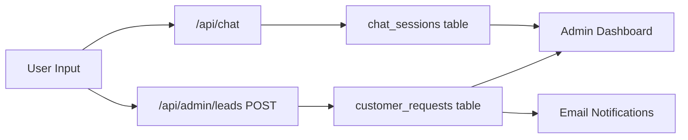
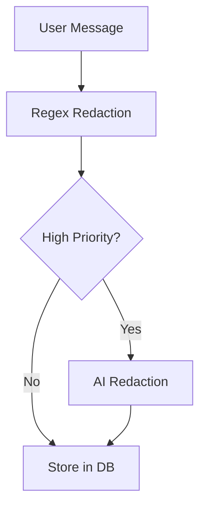

# Sensitive Data Obfuscation Strategy

## Current Data Flow



**Data at risk in:**
- `chat_sessions.messages` (full conversation JSON)
- `customer_requests.message` (last message text)
- `customer_requests.chat_context` (full conversation JSON)

## Types of Sensitive Data to Detect

- **Financial identifiers**: Account numbers, routing numbers, credit card numbers, loan numbers, member IDs
- **Government IDs**: SSN, driver's license, passport numbers
- **Health information**: Medical conditions, prescriptions, diagnoses (HIPAA)
- **Financial details**: Specific balances, income amounts, debt figures
- **Authentication data**: PINs, passwords, security answers

---

## Option 1: Regex-Based Pattern Detection (Simplest)

**Approach:** Use regular expressions to detect and mask known patterns.

**Pros:**
- Fast and cheap (no API calls)
- Deterministic and auditable
- No external dependencies

**Cons:**
- Misses context-sensitive data (e.g., "my account ending in 4532")
- Requires maintenance as patterns evolve
- Can false-positive on legitimate data (e.g., phone numbers)

**Example patterns:**

```typescript
const SENSITIVE_PATTERNS = [
  { name: 'SSN', pattern: /\b\d{3}[-\s]?\d{2}[-\s]?\d{4}\b/g },
  { name: 'Credit Card', pattern: /\b\d{4}[-\s]?\d{4}[-\s]?\d{4}[-\s]?\d{4}\b/g },
  { name: 'Account Number', pattern: /\b(?:account|acct|member)[\s#:]*\d{6,16}\b/gi },
  { name: 'Routing Number', pattern: /\b(?:routing|aba)[\s#:]*\d{9}\b/gi },
]
```

**Implementation:** Create `lib/pii-redactor.ts` used in both `/api/chat` and `/api/admin/leads`.

---

## Option 2: AI-Powered Detection (Using Existing Groq/Llama)

**Approach:** Send text through an LLM with a PII-detection prompt before storage.

**Pros:**
- Understands context ("my account ending in 4532", "I make $85k")
- Catches semantic sensitive info (health conditions, financial struggles)
- Adapts without code changes

**Cons:**
- Adds latency (~200-500ms per call)
- Additional API cost
- Non-deterministic (may vary between runs)

**Implementation:**

```typescript
async function detectAndRedactPII(text: string): Promise<string> {
  const response = await groq.chat.completions.create({
    model: 'llama-3.3-70b-versatile',
    messages: [{
      role: 'system',
      content: `You are a PII detection assistant. Return the input text with ALL sensitive information replaced:
- Replace SSNs, account numbers, card numbers with [REDACTED_ID]
- Replace specific dollar amounts with [AMOUNT]
- Replace health conditions with [HEALTH_INFO]
- Keep: names, emails, phone numbers (these are allowed contact info)
Return ONLY the redacted text, nothing else.`
    }, {
      role: 'user',
      content: text
    }],
    temperature: 0,
    max_tokens: 2000,
  })
  return response.choices[0]?.message?.content || text
}
```

---

## Option 3: Hybrid Approach (Recommended)

**Approach:** Fast regex pass first, then optional AI pass for high-value leads.

**Pros:**
- Best of both worlds
- Regex catches obvious patterns instantly
- AI catches contextual leaks
- Can toggle AI pass based on business rules

**Cons:**
- More complex implementation
- Higher cost for AI-enabled paths

**Flow:**



---

## Option 4: Third-Party PII Services

**AWS Comprehend PII Detection:**
- Enterprise-grade, HIPAA-eligible
- Detects 30+ PII entity types
- ~$0.0001 per unit (100 chars)

**Google Cloud DLP:**
- Most comprehensive (150+ infoTypes)
- Custom detectors possible
- ~$1-3 per 1000 API calls

**Microsoft Presidio (Open Source):**
- Self-hosted, no API costs
- Python-based, would need a microservice
- Customizable recognizers

---

## Recommendation: Hybrid with Regex + Selective AI

**Implementation plan:**

1. **Create `lib/pii-redactor.ts`** with:
   - Regex patterns for definite PII (SSN, card numbers, account patterns)
   - Function to call Groq for semantic detection
   - Configurable modes: `regex-only`, `ai-only`, `hybrid`

2. **Modify `/api/chat/route.ts`** ([website/app/api/chat/route.ts](website/app/api/chat/route.ts)):
   - Redact user messages before storing in `chat_sessions`
   - Keep original message for LLM context (in-memory only)

3. **Modify `/api/admin/leads/route.ts`** ([website/app/api/admin/leads/route.ts](website/app/api/admin/leads/route.ts)):
   - Redact `message` and `chat_context` before INSERT
   - Apply AI redaction for leads (higher value)

4. **Add email notification** (future):
   - Double-ensure redaction before email send

---

## Redaction Format Options

| Style | Example | Use Case |
|-------|---------|----------|
| Full mask | `*****` | Maximum privacy |
| Bracketed | `[REDACTED]` | Clear indication something was removed |
| Typed bracket | `[SSN]`, `[ACCOUNT]` | Indicates what type was redacted |
| Partial | `***-**-4532` | Allows verification while protecting |

**Recommendation:** Use typed brackets like `[ACCOUNT_NUMBER]`, `[SSN]`, `[HEALTH_INFO]` - this tells staff something was there without revealing it.

---

## Files to Create/Modify

- **Create:** `website/lib/pii-redactor.ts` - Core redaction logic
- **Modify:** `website/app/api/chat/route.ts` - Redact before DB storage
- **Modify:** `website/app/api/admin/leads/route.ts` - Redact leads before INSERT