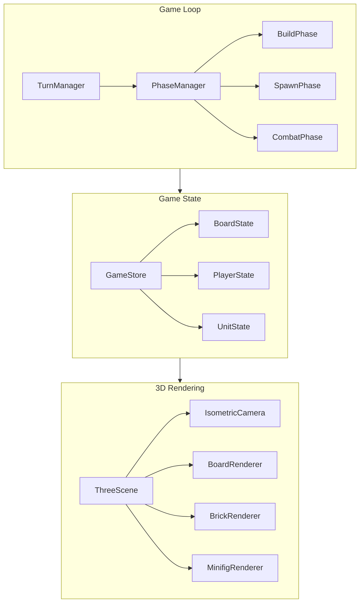

# Realms - 3D Isometric Strategy Game Prototype

## Tech Stack

- **Frontend**: Vite + TypeScript + Three.js for 3D isometric rendering
- **State Management**: Zustand for game state
- **AI**: Simple rule-based AI for prototype (attack nearest, defend castle)
- **No backend needed** for single-player prototype

## Game Board Layout

Based on your image, the board consists of:

```javascript
        [Green Realm 7x7]
              |
              [Gray Path 2x5]
              |
[Orange] - [Gray] - [Black 4x4] - [Gray] - [Blue]
[7x7]      [5x2]   [Battlefield]   [5x2]    [7x7]
              |
              [Gray Path 2x5]
              |
        [Red Realm 7x7]
```


## Core Systems Architecture




## Prototype Features

### Phase 1: Foundation

- Isometric 3D board with four colored realms + central battlefield
- Camera controls (pan, zoom, rotate)
- Grid-based tile highlighting and selection

### Phase 2: Building System

- Freeform brick placement in your realm (1x1, 2x1, 2x2 bricks)
- Brick colors matching realm color
- Stacking bricks vertically (LEGO-style)
- Castle "core" block that must be defended

### Phase 3: Units and Combat

- Spawn basic minifig warriors from castle
- Unit movement on grid (limited moves per turn like chess)
- Simple combat (attack adjacent enemies)
- Unit upgrades: melee, ranged, defensive

### Phase 4: AI Opponent

- Simple AI that builds, spawns, and attacks
- Win condition: capture opponent's castle core

## File Structure

```javascript
realms/
├── index.html
├── package.json
├── tsconfig.json
├── vite.config.ts
├── src/
│   ├── main.ts              # Entry point
│   ├── game/
│   │   ├── Game.ts          # Main game controller
│   │   ├── TurnManager.ts   # Turn and phase management
│   │   └── AI.ts            # AI opponent logic
│   ├── rendering/
│   │   ├── Scene.ts         # Three.js scene setup
│   │   ├── Camera.ts        # Isometric camera
│   │   ├── Board.ts         # Board grid rendering
│   │   ├── Brick.ts         # Brick meshes
│   │   └── Minifig.ts       # Unit meshes
│   ├── state/
│   │   ├── store.ts         # Zustand store
│   │   └── types.ts         # TypeScript interfaces
│   └── ui/
│       └── HUD.ts           # Simple HTML overlay UI
└── spec.md                  # Game design document
```


## Next Steps

1. First, I'll flesh out [spec.md](spec.md) with detailed game rules
2. Set up the project with Vite + Three.js + TypeScript
3. Build the board and camera system
4. Add brick placement mechanics
5. Implement units and combat