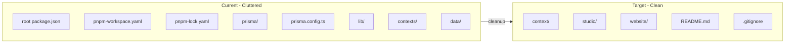

# Simplify Repository Structure

Convert from pnpm workspace monorepo to independent packages like magnet-web.

## Current vs Target Structure



## Files to Delete

| Path | Reason |
|------|--------|
| [`prisma/`](prisma/) | Duplicate of website's, no migrations |
| [`prisma.config.ts`](prisma.config.ts) | Duplicate with merge conflicts |
| [`lib/`](lib/) | Duplicate with debug logging code |
| [`contexts/`](contexts/) | Duplicate with debug logging code |
| [`data/`](data/) | Empty, unused workspace package |
| [`package.json`](package.json) | Workspace root config |
| [`pnpm-workspace.yaml`](pnpm-workspace.yaml) | Workspace definition |
| `pnpm-lock.yaml` | Workspace lockfile |
| `node_modules/` | Will regenerate per-package |

## Post-Cleanup: Generate Studio Lockfile

The [`studio/`](studio/) package currently has no lockfile (was using root's). After cleanup:

```bash
cd studio && pnpm install
```

This generates `studio/pnpm-lock.yaml`.

## Final Structure

```
enthusiastauto/
├── context/          # Documentation
├── studio/           # Sanity CMS (independent)
│   ├── package.json
│   └── pnpm-lock.yaml  # NEW
├── website/          # Next.js app (independent)
│   ├── package.json
│   └── pnpm-lock.yaml  # Already exists
├── .gitignore
└── README.md
```

## Update README

Update [`README.md`](README.md) to reflect the new structure - remove any references to workspace commands and update Quick Start to match magnet-web's style:

```bash
cd website && pnpm dev    # Website at localhost:3000
cd studio && pnpm dev     # Sanity Studio at localhost:3333
```