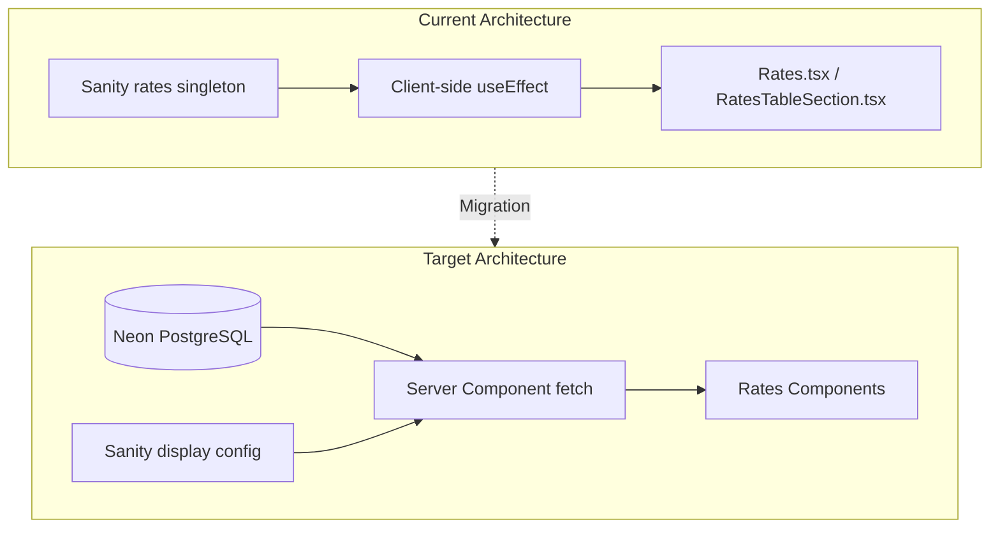

# Rates Migration to Neon

## Architecture Overview



## Phase 1: Database Schema (Neon)

Create PostgreSQL tables in Neon to store all rate data with full audit history.

**File to create:** `website/lib/db/schema.sql`

Key tables:

- `rate_categories` - Product categories (mortgage, savings, loans, etc.)
- `rate_products` - Individual products within categories
- `rate_tiers` - Rate values with optional term/balance tiers
- `rate_disclosures` - Legal text and disclaimers per category
- `calculator_config` - Mortgage calculator assumptions
- `rate_metadata` - Institution info, effective dates, PDF links
- `rate_changes` - Full audit log (user, timestamp, field, old/new values)

**Example schema structure:**

```sql
-- Core tables
CREATE TABLE rate_categories (
  id SERIAL PRIMARY KEY,
  slug VARCHAR(50) UNIQUE NOT NULL,
  name VARCHAR(100) NOT NULL,
  rate_type VARCHAR(10) CHECK (rate_type IN ('APR', 'APY')),
  sort_order INTEGER DEFAULT 0,
  is_active BOOLEAN DEFAULT true
);

CREATE TABLE rate_products (
  id SERIAL PRIMARY KEY,
  category_id INTEGER REFERENCES rate_categories(id),
  slug VARCHAR(100) NOT NULL,
  name VARCHAR(200) NOT NULL,
  term_months INTEGER,
  min_balance DECIMAL(12,2),
  max_balance DECIMAL(12,2),
  rate DECIMAL(8,6),
  apy DECIMAL(8,6),
  apr DECIMAL(8,6),
  notes TEXT,
  sort_order INTEGER DEFAULT 0,
  is_active BOOLEAN DEFAULT true,
  updated_at TIMESTAMP DEFAULT NOW()
);

-- Audit trail
CREATE TABLE rate_changes (
  id SERIAL PRIMARY KEY,
  table_name VARCHAR(50) NOT NULL,
  record_id INTEGER NOT NULL,
  field_name VARCHAR(100) NOT NULL,
  old_value TEXT,
  new_value TEXT,
  changed_by VARCHAR(100) NOT NULL,
  changed_at TIMESTAMP DEFAULT NOW(),
  change_type VARCHAR(20) CHECK (change_type IN ('insert', 'update', 'delete'))
);
```

## Phase 2: API Layer

Create new API routes for Neon rate operations alongside existing Sanity routes.

**Files to create:**

- `website/lib/db/rates.ts` - Database query functions
- `website/app/api/rates/route.ts` - Public GET endpoint (for frontend)
- `website/app/api/admin/rates-v2/route.ts` - Admin CRUD operations
- `website/app/api/admin/rates-v2/audit/route.ts` - Audit log queries

The public API should return data in the same shape as current Sanity queries to minimize frontend changes.

## Phase 3: Migration Script

Create a one-time migration script to copy existing Sanity data to Neon.

**File to create:** `website/scripts/migrate-rates-to-neon.ts`

This script will:

1. Fetch all rate data from Sanity (`ratesQuery`)
2. Transform nested Sanity structure to relational tables
3. Insert into Neon with proper foreign key relationships
4. Log the migration for verification

**Data mapping:**

| Sanity Field | Neon Table |

|-------------|------------|

| `mortgageRates.*` | `rate_products` (category: mortgage) |

| `savingsRates.*` | `rate_products` (category: savings) |

| `cdRates.*` | `rate_products` (category: cd) |

| `loanRates.*` | `rate_products` (category: loan) |

| `creditCardRates.*` | `rate_products` (category: credit_card) |

| `savingsAccounts.products` | `rate_products` (category: savings_detailed) |

| `homeEquity.heloc.products` | `rate_products` (category: heloc) |

| `homeEquity.secondMortgage.products` | `rate_products` (category: second_mortgage) |

| `comprehensiveCreditCards.products` | `rate_products` (category: credit_card_detailed) |

| `businessShareCertificates.*` | `rate_products` (category: business_cd) |

| `productCategories` | `rate_categories` + `rate_products` |

| `assumptions.*` | `calculator_config` |

| `meta.*` | `rate_metadata` |

| `*.disclosures` | `rate_disclosures` |

## Phase 4: Update Admin Portal

Modify the `data/` app to interact with Neon instead of Sanity.

**Files to modify:**

- [data/src/api/rates.ts](data/src/api/rates.ts) - Point to new `/api/admin/rates-v2` endpoints
- [data/src/types/rates.ts](data/src/types/rates.ts) - Update types for relational structure
- [data/src/components/rates/RatesModule.tsx](data/src/components/rates/RatesModule.tsx) - Update data fetching/saving
- Section components in `data/src/components/rates/sections/` - Update to work with new data shape

The admin portal will gain:

- Real-time audit log viewing
- Simpler data editing (flat tables vs nested objects)
- Draft/publish workflow via a `is_draft` column or separate draft tables

## Phase 5: Update Frontend Components

Refactor rate display components for server-side data fetching.

**Files to modify:**

1. **Create server-side data fetcher:**

   - `website/lib/rates.ts` - `fetchRates()` function that queries Neon

2. **Update page components to fetch server-side:**

   - [website/app/[...path]/page.tsx](website/app/[...path]/page.tsx) - Add rates to parallel fetch

3. **Convert rate components to accept props (remove client-side fetching):**

   - [website/app/components/sections/RatesWrapper.tsx](website/app/components/sections/RatesWrapper.tsx) - Remove `useEffect`, accept `globalRates` as prop
   - [website/app/components/sections/RatesTableSection.tsx](website/app/components/sections/RatesTableSection.tsx) - Remove `useEffect`, accept `globalRates` as prop
   - [website/app/components/sections/Rates.tsx](website/app/components/sections/Rates.tsx) - Already accepts props, may need minor updates

4. **Update BlockRenderer to pass rates:**

   - [website/app/components/layout/BlockRenderer.tsx](website/app/components/layout/BlockRenderer.tsx) - Accept and pass `globalRates` to rate sections

5. **Update PageBuilder:**

   - [website/app/components/layout/PageBuilder.tsx](website/app/components/layout/PageBuilder.tsx) - Accept and pass `globalRates`

**Key change:** The `ratePath` references in Sanity (e.g., `mortgageRates.thirtyYearFixed`) will need a mapping layer to query Neon by category + product slug.

## Phase 6: Sanity Schema Updates

Keep Sanity for display configuration but update schemas to reference Neon.

**Files to modify:**

- [studio/src/schemaTypes/objects/ratesSection.ts](studio/src/schemaTypes/objects/ratesSection.ts) - Change `ratePath` dropdown to reference Neon product slugs
- [studio/src/schemaTypes/objects/ratesTableSection.ts](studio/src/schemaTypes/objects/ratesTableSection.ts) - Same updates
- [website/sanity/lib/queries.ts](website/sanity/lib/queries.ts) - Remove `ratesQuery` (no longer needed after migration complete)

**Note:** The `rates` singleton in Sanity will remain untouched until final verification.

## Phase 7: Testing and Verification

Before removing Sanity data:

1. Create a visual comparison tool or manually verify all rate displays match
2. Test admin portal CRUD operations
3. Verify audit logging captures all changes
4. Test with draft/publish workflow
5. Performance test server-side fetching vs current client-side

## Phase 8: Cleanup (Only After Confirmation)

Once verified:

- Remove [studio/src/schemaTypes/singletons/rates.tsx](studio/src/schemaTypes/singletons/rates.tsx)
- Remove rates from [studio/src/schemaTypes/index.ts](studio/src/schemaTypes/index.ts)
- Remove `ratesQuery` from queries
- Remove old `/api/admin/rates` routes
- Delete Sanity rates document

## Environment Variables

New variables needed:

```
# Already have POSTGRES_URL from @vercel/postgres
# May need separate connection for migrations:
POSTGRES_URL_NON_POOLING=postgres://...
```

## Rollback Strategy

If issues arise:

1. Frontend can switch back to Sanity by reverting the data fetching changes
2. Sanity data remains intact throughout migration
3. API routes are versioned (`/api/admin/rates-v2`) so old routes still work