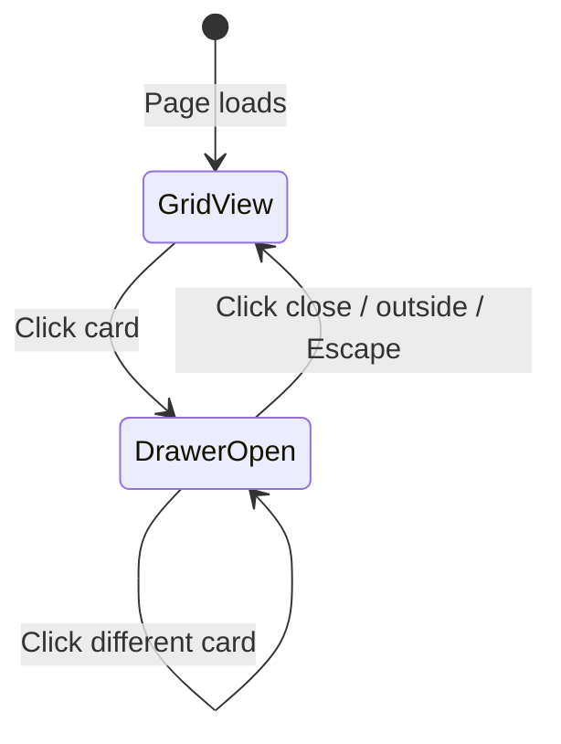

# Team Page: Interactive Card Grid Layout

## Concept

Replace the current wall-of-bios layout with a **clean card grid** that rewards exploration:

```
┌─────────┐  ┌─────────┐  ┌─────────┐  ┌─────────┐
│  Photo  │  │  Photo  │  │  Photo  │  │  Photo  │
│         │  │         │  │         │  │         │
├─────────┤  ├─────────┤  ├─────────┤  ├─────────┤
│  Name   │  │  Name   │  │  Name   │  │  Name   │
│  Role   │  │  Role   │  │  Role   │  │  Role   │
└─────────┘  └─────────┘  └─────────┘  └─────────┘
```

Clicking a card opens a **slide-out drawer** from the right with the full bio, photo, and name. This keeps the page scannable while allowing deep dives.

## Page Structure

1. **Hero** — "Craftsmanship elevated by a culture of quality" (keep existing)
2. **Leadership Grid** — 6 cards, larger size (2 per row on desktop)
3. **Extended Team Grid** — 8 cards, standard size (4 per row on desktop)
4. **Careers CTA** — (keep existing)

## Key Components to Create

### 1. Team Card Component
- Photo with subtle hover effect (slight scale, border highlight)
- Name and role below
- Cursor indicates interactivity
- Accessible: button semantics, keyboard navigation

### 2. Bio Drawer Component
- Slides in from right (480px width)
- Shows: large photo, name, role, full bio paragraphs
- Close button and click-outside-to-close
- Smooth CSS transition (300ms ease-in-out)
- Body scroll locked while open

### 3. Team Grid Section
- Configurable columns (2 for leadership, 4 for extended)
- Gap and spacing per design system

## Files to Modify/Create

| File | Action |
|------|--------|
| [`website/src/components/sections/team-card-grid.tsx`](website/src/components/sections/team-card-grid.tsx) | Create new — card grid with drawer |
| [`website/src/app/team/page.tsx`](website/src/app/team/page.tsx) | Update to use new component |

## Visual Details

- **Card hover**: `scale-[1.02]` with `ring-2 ring-ember/20` border
- **Drawer**: `bg-frost` with `shadow-xl`, slides from right
- **Transition**: `duration-300 ease-in-out` (per design system)
- **Dark mode**: Supported via standard Tailwind patterns

## Interaction Flow



## Why This Works

- **Scannable**: 14 people visible at once vs. scrolling through walls of text
- **Purposeful motion**: Drawer is functional, not decorative
- **Calm**: Clean grid, no competing elements
- **Senior**: Rewards intentional exploration